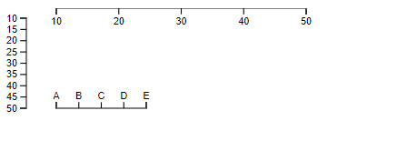

the axis component renders human-readable reference marks for scales.

```js
const axis = d3.axisLeft(scale);

d3.select("body").append("svg")
    .attr("width", 1440)
    .attr("height", 30)
  .append("g")
    .attr("transform", "translate(0,30)")
    .call(axis);
```
Axis
* axisTop(scale), construct a new top-oriented axis generator for the given scale, with empty tick arguments, a tick size of 6 and padding of 3. in this orientation, ticks are drawn above the horizontal domain path
* axisRight(scale), in this orientation, ticks are drawn to the right of the vertical domain path
* axisBottom(scale), 
* axisLeft(scale)
* axis(context), *axis* is the axis function generated by axisTop/axisBottom..., context could be either a selection of SVG container or *g* element
* axis.scale([scale]), if *scale* is specified, set the scale and return the axis, if not, return current scale
* axis.ticks(arguments...), specify the argument for ticks that will be passed to scale.ticks and scale.tickFormat when the axis is rendered
* axis.tickValues([values]), specifed the values are used for ticks rather than using the scale's automatic tick generator
* axis.tickFormat([format])

```js
axis.ticks(20, "s");

axis.ticks(d3.timeMinute.every(15));

axis.ticks(10);

var xAxis = d3.axisBottom(x)
    .tickValues([1, 2, 3, 5, 8, 13, 21]);

axis.tickFormat(d3.format(",.0f"));

axis.ticks(10, ",f");
```

Example
```js
let svg = d3.select('#container')
.append('svg')
.attr('width', 400)
.attr('height', 400)
//the range is the pixel position for axis
let scale = d3.scaleLinear().domain([10, 50]).range([50, 300])

const axis = d3.axisBottom(scale)

axis.ticks(5)

let g = svg.append('g').call(axis)

const yaxis = d3.axisLeft(scale.copy().range([10, 100]))

yaxis.ticks(10)
//if does not translate, could not see tick label
svg.append('g').attr('transform', `translate(20, 0)`).call(yaxis)

let points = d3.scalePoint().domain(["A", "B", "C", "D", "E"]).range([10, 100])
svg.append('g').attr('transform', `translate(40, 100)`).call(d3.axisTop(points))

```

