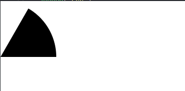
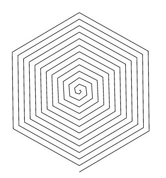

Visualizations typically consist of discrete graphical marks, such as symbols, arcs, lines and areas. While the rectangles of a bar chart may be easy enough to generate directly using SVG or Canvas, other shapes are complex, such as rounded annular sectors and centripetal Catmull–Rom splines. This module provides a variety of shape generators for your convenience.

# Arcs
## d3.arc()
construct a new arc generator with the default setting
## arc(arguments...)
Generates an arc for the given arguments.
```js
const arc = d3.arc();

d = arc({
  innerRadius: 0,
  outerRadius: 100,
  startAngle: Math.PI / 6,
  endAngle: Math.PI / 2
}); // "M0,-100A100,100,0,0,1,100,0L0,0Z"

//equals to

const arc = d3.arc()
    .innerRadius(0)
    .outerRadius(100)
    .startAngle(Math.PI / 6)
    .endAngle(Math.PI / 2);

d = arc()//"M0,-100A100,100,0,0,1,100,0L0,0Z"

//note that Arcs are always centered at ⟨0,0⟩; use a transform (see: SVG, Canvas) to move the arc to a different position.

d3.select('body').style('margin', 0)
.select('div')
.append('svg')
  .attr('height', 400)
  .attr('width', 400)
.append('path')
.attr('d', d)
.attr('transform', 'translate(0, 100)')
```


## arc.centroid(arguments...)
Computes the midpoint [x, y] of the center line of the arc that would be generated by the given arguments.

Note that this is not the geometric center of the arc, which may be outside the arc; this method is merely a convenience for positioning labels.

## arc.innerRadius([value])
If radius is specified, sets the inner radius to the specified function or number and returns this arc generator. If radius is not specified, returns the current inner radius accessor

## arc.outerRadius([value])
If radius is specified, sets the outer radius to the specified function or number and returns this arc generator. If radius is not specified, returns the current outer radius accessor

## arc.cornerRadius([value])
If radius is specified, sets the corner radius to the specified function or number and returns this arc generator. If radius is not specified, returns the current corner radius accessor

If the corner radius is greater than zero, the corners of the arc are rounded using circles of the given radius. For a circular sector, the two outer corners are rounded; for an annular sector, all four corners are rounded.

## arc.startAngle([angle])
The angle is specified in radians, with 0 at -y (12 o’clock) and positive angles proceeding clockwise.

## arc.endAngle([angle])
The angle is specified in radians

## arc.context([context])
If the context is not null, then the generated arc is rendered to this context as a sequence of path method calls. Otherwise, a path data string representing the generated arc is returned.

# Pies
The pie generator does not produce a shape directly, but instead computes the necessary angles to represent a tabular dataset as a pie or donut chart; these angles can then be passed to an arc generator.

## d3.pie()
Constructs a new pie generator with the default settings.

## pie(data[,arguments])
Generates a pie for the given array of data, returning an array of objects representing each datum’s arc angles. The length of the returned array is the same as data, and each element i in the returned array corresponds to the element i in the input data. Each object in the returned array has the following properties:
* data - the input datum; the corresponding element in the input data array.
* value - the numeric value of the arc. if the datum is not numeric, return NaN
* index - the zero-based sorted index of the arc. by default, the pie chart is sorted by descending value. in other word, the biggest value datum has index 0, and its startAngle is 0
* startAngle - the start angle of the arc.
* endAngle - the end angle of the arc.
* padAngle - the pad angle of the arc.

if you plan to use the pie generator in conjunction with an arc generator, you should specify angles in radians, with 0 at -y (12 o’clock) and positive angles proceeding clockwise.
```js
const data = [1, 1, 2, 3, 5, 8, 13, 21];
const arcs = d3.pie()(data);

//arcs
[
  {"data":  1, "value":  1, "index": 6, "startAngle": 6.050474740247008, "endAngle": 6.166830023713296, "padAngle": 0},
  {"data":  1, "value":  1, "index": 7, "startAngle": 6.166830023713296, "endAngle": 6.283185307179584, "padAngle": 0},
  {"data":  2, "value":  2, "index": 5, "startAngle": 5.817764173314431, "endAngle": 6.050474740247008, "padAngle": 0},
  {"data":  3, "value":  3, "index": 4, "startAngle": 5.468698322915565, "endAngle": 5.817764173314431, "padAngle": 0},
  {"data":  5, "value":  5, "index": 3, "startAngle": 4.886921905584122, "endAngle": 5.468698322915565, "padAngle": 0},
  {"data":  8, "value":  8, "index": 2, "startAngle": 3.956079637853813, "endAngle": 4.886921905584122, "padAngle": 0},
  {"data": 13, "value": 13, "index": 1, "startAngle": 2.443460952792061, "endAngle": 3.956079637853813, "padAngle": 0},
  {"data": 21, "value": 21, "index": 0, "startAngle": 0.000000000000000, "endAngle": 2.443460952792061, "padAngle": 0}
]
```
## pie.value([value])
If value is specified, sets the value accessor to the specified function or number and returns this pie generator. If value is not specified, returns the current value accessor. by default, the value accessor return the datum directly.

this is useful when the datum is not numeric, such as object, we can specify the value accessor.

When a pie is generated, the value accessor will be invoked for each element in the input data array, being passed the element d, the index i, and the array data as three arguments. 
```js
pie.value((d, i, datas) => {})
```

## pie.sort([compare])
If compare is specified, sets the data comparator to the specified function and returns this pie generator. If compare is not specified, returns the current data comparator, which defaults to null. If both the data comparator and the value comparator are null, then arcs are positioned in the original input order. Otherwise, the data is sorted according to the data comparator, and the resulting order is used. Setting the data comparator implicitly sets the value comparator to null.

The compare function takes two arguments a and b, each elements from the input data array. If the arc for a should be before the arc for b, then the comparator must return a number less than zero; if the arc for a should be after the arc for b, then the comparator must return a number greater than zero; returning zero means that the relative order of a and b is unspecified

Sorting does not affect the order of the generated arc array which is always in the same order as the input data array; it merely affects the computed angles of each arc. in other word, the output array elements order is not changed,  only update the value for 'index' and its corresponding startAngle/endAngle for each element based on sorting results

## pie.sortValues([compare])
the default value comparator is
```js
function compare(a, b) {
  return b - a;//descending order by default, bigger value, smaller index
}
```
The value comparator is similar to the data comparator, except the two arguments a and b are values derived from the input data array using the value accessor, not the data elements. 

## pie.startAngle([angle])
If angle is specified, sets the overall start angle of the pie to the specified function or number and returns this pie generator. If angle is not specified, returns the current start angle accessor, default return 0

## pie.endAngle([angle])
If angle is specified, sets the overall end angle of the pie to the specified function or number and returns this pie generator. If angle is not specified, returns the current end angle accessor,  default return Math.PI * 2

## pie.padAngle([angle])
If angle is specified, sets the pad angle to the specified function or number and returns this pie generator. If angle is not specified, returns the current pad angle accessor, default return 0

The pad angle here means the angular separation between each adjacent arc. The total amount of padding reserved is the specified angle times the number of elements in the input data array, and at most |endAngle - startAngle|; the remaining space is then divided proportionally by value such that the relative area of each arc is preserved.

# Lines
The line generator produces a spline or polyline

## d3.line([x][,y])
Constructs a new line generator with the default settings. If x or y are specified, sets the corresponding accessors to the specified function or number and returns this line generator.

## line(data)
Generates a line for the given array of data. Depending on this line generator’s associated curve, the given input data may need to be sorted by x-value before being passed to the line generator.

## line.x([x])
If x is specified, sets the x accessor to the specified function or number and returns this line generator. If x is not specified, returns the current x accessor

When a line is generated, the x accessor will be invoked for each defined element in the input data array, being passed the element d, the index i, and the array data as three arguments.

The default x accessor assumes that the input data are two-element arrays of numbers. so get x through d[0], and get y through d[1]

## line.y([y])
If y is specified, sets the y accessor to the specified function or number and returns this line generator. If y is not specified, returns the current y accessor

## line.curve([curve])
If curve is specified, sets the curve factory and returns this line generator. If curve is not specified, returns the current curve factory, which defaults to curveLinear

## d3.lineRadial()
Constructs a new radial line generator with the default settings. Radial lines are always positioned relative to ⟨0,0⟩; use a transform (see: SVG, Canvas) to change the origin.

d3.lineRadial is similar to d3.line but, instead of cartesian coordinates (x and y), it works with radial coordinates (angle and radius).

the default accessors are d[0] for anle, and d[1] for radius

## lineRadial(data)
equivalent to line

## lineRadial.angle([angle])
Equivalent to line.x, except the accessor returns the angle in radians

## lineRadial.radius([radius])
Equivalent to line.y, except the accessor returns the radius: the distance from the origin ⟨0,0⟩.

```js
const spiral = Array.from({length:76}, (_, i) => [
	(Math.PI / 3) * i,
    2 * i
])

let rg = d3.select('svg')
.append('g')
	.attr('transform', 'translate(350, 200)')

rg.append('path')
	.attr('d', d3.lineRadial()(spiral))
  .style('fill', 'none')
  .attr('stroke', 'black')
```


# Areas
The area generator produces an area, as in an area chart. An area is defined by two bounding lines, either splines or polylines. Typically, the two lines share the same x-values (x0 = x1), differing only in y-value (y0 and y1); most commonly, y0 is defined as a constant representing zero. The first line (the topline) is defined by x1 and y1 and is rendered first; the second line (the baseline) is defined by x0 and y0 and is rendered second, with the points in reverse order.

## d3.area([x][,y0][,y1])
Constructs a new area generator with the default settings. If x, y0 or y1 are specified, sets the corresponding accessors to the specified function or number and returns this area generator.

## area(data)
Generates an area for the given array of data. Depending on this area generator’s associated curve, the given input data may need to be sorted by x-value before being passed to the area generator. 

## area.x([x])
If x is specified, sets x0 to x and x1 to null and returns this area generator. If x is not specified, returns the current x0 accessor.

## area.x0([x])
If x is specified, sets the x0 accessor to the specified function or number and returns this area generator. If x is not specified, returns the current x0 accessor, by default, it return d[0]

When an area is generated, the x0 accessor will be invoked for each defined element in the input data array, being passed the element d, the index i, and the array data as three arguments. The default x0 accessor assumes that the input data are two-element arrays of numbers.

## area.x1([x])
If x is specified, sets the x1 accessor to the specified function or number and returns this area generator. If x is not specified, returns the current x1 accessor, which defaults to null, indicating that the previously-computed x0 value should be reused for the x1 value.

When an area is generated, the x1 accessor will be invoked for each defined element in the input data array, being passed the element d, the index i, and the array data as three arguments. 

## area.y([y])
If y is specified, sets y0 to y and y1 to null and returns this area generator. If y is not specified, returns the current y0 accessor.

## area.y0([y])
If y is specified, sets the y0 accessor to the specified function or number and returns this area generator. If y is not specified, returns the current y0 accessor, by default, return 0

When an area is generated, the y0 accessor will be invoked for each defined element in the input data array, being passed the element d, the index i, and the array data as three arguments. 

## area.y1([y])
If y is specified, sets the y1 accessor to the specified function or number and returns this area generator. If y is not specified, returns the current y1 accessor, by default, return d[1]

A null accessor is also allowed, indicating that the previously-computed y0 value should be reused for the y1 value. When an area is generated, the y1 accessor will be invoked for each defined element in the input data array, being passed the element d, the index i, and the array data as three arguments.

## d3.areaRadial()
Constructs a new radial area generator with the default settings. A radial area generator is equivalent to the standard Cartesian area generator, except the x and y accessors are replaced with angle and radius accessors. Radial areas are always positioned relative to ⟨0,0⟩; use a transform (see: SVG, Canvas) to change the origin.

## areaRadial(data)
Equivalent  to *area(data)*

## areaRadial.angle([angle])
Equivalent to area.x, except the accessor returns the angle in radians, with 0 at -y (12 o’clock).

## areaRadial.startAngle([angle])
Equivalent to area.x0, except the accessor returns the angle in radians, with 0 at -y (12 o’clock). Note: typically angle is used instead of setting separate start and end angles.

## areaRadial.endAngle([angle])
Equivalent to area.x1, except the accessor returns the angle in radians, with 0 at -y (12 o’clock). Note: typically angle is used instead of setting separate start and end angles.

## areaRadial.radius([radius])
Equivalent to area.y, except the accessor returns the radius: the distance from the origin ⟨0,0⟩.

## areaRadial.innerRadius([radius])
Equivalent to area.y0, except the accessor returns the radius: the distance from the origin ⟨0,0⟩.

## areaRadial.outerRadius([radius])
Equivalent to area.y1, except the accessor returns the radius: the distance from the origin ⟨0,0⟩.

# Curves
While lines are defined as a sequence of two-dimensional [x, y] points, and areas are similarly defined by a topline and a baseline, there remains the task of transforming this discrete representation into a continuous shape: i.e., how to interpolate between the points. A variety of curves are provided for this purpose.

Curves are typically not constructed or used directly, instead being passed to line.curve and area.curve. For example:
```js
const line = d3.line(d => d.date, d => d.value)
    .curve(d3.curveCatmullRom.alpha(0.5));
```

# Links
The link shape generates a smooth cubic Bézier curve from a source point to a target point. The tangents of the curve at the start and end are either vertical, horizontal or radial.

A link generator needs an object with a source and a target; within each should be an array with two numbers representing the x and y values of where the link should start and end.

## d3.linkVertical()
Returns a new link generator with vertical tangents. 

## d3.linkHorizontal()
Returns a new link generator with horizontal tangents. 

## link.source([source])
If source is specified, sets the source accessor to the specified function and returns this link generator. If source is not specified, returns the current source accessor, the default source accessor is d => d.source

## link.target([target])
If target is specified, sets the target accessor to the specified function and returns this link generator. If target is not specified, returns the current target accessor, which defaults to d=> d.target

## link.x([x])
If x is specified, sets the x-accessor to the specified function or number and returns this link generator. If x is not specified, returns the current x-accessor, which defaults to d=> d[0]

## link.y([y])
If y is specified, sets the y-accessor to the specified function or number and returns this link generator. If y is not specified, returns the current y-accessor, which defaults to: d => d[1]

## d3.linkRadial()
Returns a new link generator with radial tangents.

## linkRadial.angle([angle])
Equivalent to link.x, except the accessor returns the angle in radians

## linkRadial.radius([radius])
Equivalent to link.y, except the accessor returns the radius: the distance from the origin ⟨0,0⟩.

# Symbols
Symbols provide a categorical shape encoding as is commonly used in scatterplots. Symbols are always centered at ⟨0,0⟩; use a transform (see: SVG, Canvas) to move the symbol to a different position.

## d3.symbol([type][,size])
Constructs a new symbol generator of the specified type and size. If not specified, type defaults to a circle, and size defaults to 64.

## symbol(arguments...)
Generates a symbol for the given arguments. The arguments are arbitrary; they are simply propagated to the symbol generator’s accessor functions along with the this object. For example, with the default settings, no arguments are needed to produce a circle with area 64 square pixels. If the symbol generator has a context, then the symbol is rendered to this context as a sequence of path method calls and this function returns void. Otherwise, a path data string is returned.

## symbol.type([type])
If type is specified, sets the symbol type to the specified function or symbol type and returns this symbol generator. If type is a function, the symbol generator’s arguments and this are passed through. If type is not specified, returns the current symbol type accessor, which defaults to *circle*

## symbol.size([size])
If size is specified, sets the size to the specified function or number and returns this symbol generator. If size is a function, the symbol generator’s arguments and this are passed through. If size is not specified, returns the current size accessor, which defaults to: *64*

## symbol.context([context])
If context is specified, sets the context and returns this symbol generator. If context is not specified, returns the current context, which defaults to null. If the context is not null, then the generated symbol is rendered to this context as a sequence of path method calls. Otherwise, a path data string representing the generated symbol is returned.

## d3.symbols
An array containing the set of all built-in symbol types: circle, cross, diamond, square, star, triangle, and wye. Useful for constructing the range of an ordinal scale should you wish to use a shape encoding for categorical data.

## d3.symbolCircle
## d3.symbolCross
## d3.symbolDiamond
## d3.symbolSquare
## d3.symbolTriangle
## d3.symbolStar
## d3.symbolWye

# Stacks
Some shape types can be stacked, placing one shape adjacent to another. For example, a bar chart of monthly sales might be broken down into a multi-series bar chart by product category, stacking bars vertically. This is equivalent to subdividing a bar chart by an ordinal dimension (such as product category) and applying a color encoding.

Stacked charts can show overall value and per-category value simultaneously; however, it is typically harder to compare across categories, as only the bottom layer of the stack is aligned. So, chose the stack order carefully, and consider a streamgraph. (See also grouped charts.)

Like the pie generator, the stack generator does not produce a shape directly. Instead it computes positions which you can then pass to an area generator or use directly, say to position bars.

# d3.stack()
Constructs a new stack generator with the default settings.

# stack(data[,arguments...])
Generates a stack for the given array of data, returning an array representing each series. Any additional arguments are arbitrary; they are simply propagated to accessors along with the this object.

The series are determined by the keys accessor; each series i in the returned array corresponds to the ith key. Each series is an array of points, where each point j corresponds to the jth element in the input data. Lastly, each point is represented as an array [y0, y1] where y0 is the lower value (baseline) and y1 is the upper value (topline); the difference between y0 and y1 corresponds to the computed value for this point.

The key for each series is available as series.key, and the index as series.index. The input data element for each point is available as point.data.

For example, consider the following table representing monthly sales of fruits:

|Month | Apples | Bananas | Chrries | Dates |
| ---- | ------ | ------- | --------| ----- |
|1/2015 | 3840 | 1920 | 960 | 400 |
|2/2015 | 1600 | 1440 | 960 | 400 |
|3/2015 | 640 | 960 | 640 | 400 |
|4/2015 | 320 | 480 | 640 | 400 |

This might be represented in JS as an array of Objects
```js
const data = [
  {month: new Date(2015, 0, 1), apples: 3840, bananas: 1920, cherries: 960, dates: 400},
  {month: new Date(2015, 1, 1), apples: 1600, bananas: 1440, cherries: 960, dates: 400},
  {month: new Date(2015, 2, 1), apples:  640, bananas:  960, cherries: 640, dates: 400},
  {month: new Date(2015, 3, 1), apples:  320, bananas:  480, cherries: 640, dates: 400}
];
```

to produce a stack for this data
```js
const stack = d3.stack()
  .keys(["apples", "bananas", "cherries", "dates"])
  .order(d3.stackOrderNone)
  .offset(d3.stackOffsetNone)

const series = stack(data)
```
The resulting array has one element per series. Each series has one point per month, and each point has a lower and upper value defining the baseline and topline:
```js
[
  [[   0, 3840], [   0, 1600], [   0,  640], [   0,  320]], // apples
  [[3840, 5760], [1600, 3040], [ 640, 1600], [ 320,  800]], // bananas
  [[5760, 6720], [3040, 4000], [1600, 2240], [ 800, 1440]], // cherries
  [[6720, 7120], [4000, 4400], [2240, 2640], [1440, 1840]], // dates
]
```
Each series in then typically passed to an area generator to render an area chart, or used to construct rectangles for a bar chart.

## stack.keys([keys])
If keys is specified, sets the keys accessor to the specified function or array and returns this stack generator. If keys is not specified, returns the current keys accessor, which defaults to the empty array. ***A series (layer) is generated for each key***. Keys are typically strings, but they may be arbitrary values. The series’ key is passed to the value accessor, along with each data point, to compute the point’s value.

## stack.value([value])
If value is specified, sets the value accessor to the specified function or number and returns this stack generator. If value is not specified, returns the current value accessor, which defaults to: (d, key) => d[key]

Thus, by default the stack generator assumes that the input data is an array of objects, with each object exposing named properties with numeric values;

## stack.order([order])
If order is specified, sets the order accessor to the specified function or array and returns this stack generator. If order is not specified, returns the current order accessor, which defaults to stackOrderNone; this uses the order given by the key accessor. 

If order is a function, it is passed the generated series array and must return *an array of numeric indexes* representing the stack order. For example, the default order is defined as:
```js
//the order function define the order for each series
//by default, series order keep consistent with keys order
//after the order is computed, set the order as index property for each series
function orderNone(series) {
  let n = series.length;
  const o = new Array(n);
  while (--n >= 0) o[n] = n;
  return o;
}
```
The stack order is computed prior to the offset; thus, the lower value for all points is zero at the time the order is computed. The index attribute for each series is also not set until after the order is computed.

## stack.offset([offset])
If offset is specified, sets the offset accessor to the specified function and returns this stack generator. If offset is not specified, returns the current offset acccesor, which defaults to stackOffsetNone; this uses a zero baseline.

The offset function is passed the generated series array and the order index array; it is then responsible for updating the lower and upper values in the series array. For example, the default offset is defined as:

```js
function offsetNone(series, order) {//pass the generated series and the order computed by order function
  //use the upper point of last series as the lower point of current series
  //the current series appears to be translated
  if (!((n = series.length) > 1)) return;
  for (let i = 1, s0, s1 = series[order[0]], n, m = s1.length; i < n; ++i) {
    s0 = s1, s1 = series[order[i]];
    for (let j = 0; j < m; ++j) {
      s1[j][1] += s1[j][0] = s0[j][1];
    }
  }
}
```