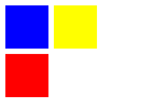

SVG(Scalable Vertor Graphics) provide options to draw different shapes such as Lines, Rectangles, Circles, Ellipses etc

# Shapes
```xml
<svg height="300" height="300"></svg>
```

create a line start at (100, 100) and ending at (200, 150) and set color for line
```xml
<svg height="300" height="300">
    <line x1="100" y1="100" x2="200" y2="150" style="stroke:rgb(255,0,0);stroke-width:2"></line>
</svg>
```

note that the origin point of svg is the left top corner (0, 0), the horizontal axis is x, the vertical axis is y

to create a line using d3, 
```js
d3.select('svg')
  .append('line')
  .attr('x1', 100)
  .attr('y1', 100)
  .attr('x2', 200)
  .attr('y2', 150)
  .style('stroke', "rgb(255,0,0)")
  .style('stroke-width', 2)
```

create a rectagle element with d3
```js
d3.select('svg')
.append('rect')
.attr("x", 20)//x,y is the top-left point
.attr("y", 20)
.attr("width", 200)
.attr("height", 100)
.attr("fill", "green");
```

create a circle element with d3
```js
d3.select('svg')
.append("circle")
.attr("cx", 200)//center x
.attr("cy", 50)//center y
.attr("r", 20)//radius
.attr("fill", "green");
```

create a ellipse element with d3
```js
d3.select('svg')
.append("ellipse")
.attr("cx", 200)
.attr("cy", 50)
.attr("rx", 100)//radius for x direction
.attr("ry", 50)//radius for y direction
.attr("fill", "green")
```

create a text element with d3
```js
d3.select('svg')
.append('text')
.attr('x', 100)
.attr('y', 100)
.attr('dx', 10)
.attr('dy', '.5em')
.text('hello world')
```

create a path element.

*<path>* could be used to create both basic/advanced shapes, its defined by its attribute *d*

属性 d 的值是一个 "命令 + 参数" 的序列，每一个命令都用一个关键字母来表示，跟在字母后面的就是该命令需要的参数
```js
M = move to, 需要指定 x, y, 但只是移动到指定位置，并不会画线，一般用来指明从何处开始画
L = line to, 需要指定 x, y, 从当前位置画线到指定 x, y
H = horizontal line to
V = vertical line to
C = curve to
S = smooth curve to
Q = quadratic Bezier curve
T = smooth quadratic bezier curve
A = elliptical arc
Z = close path

注意上面所有命令都允许小写字母。大写表示绝对定位，小写表示相对定位
```
take rectangle as example
```js
let svg = d3.select('#container')
.append('svg')
.attr('height', 500)
.attr('width', 500)

svg.append('path')
.attr('d', 'M 10 10 H 90 V 90 H 10 L 10 10')
.style('fill', 'blue')

//还可以通过 z 来简化, 因为 Z 表示回到起点
svg.append('path')
.attr('d', 'M 100 10 H 180 V 90 H 100 Z')
.style('fill', 'yellow')

//还可以通过相对定位来定义, 小写字母的命令参数不是指定一个明确的坐标，而是相对于它前面的点需要移动多少距离
svg.append('path')
.attr('d', 'M 10 100 h 80 v 80 h -80 Z')
.style('fill', 'red')
```



d3 对 svg path　也有适配　d3-path

```js
let path = d3.path()//create a path

path.moveTo(0, 0)

path.lineTo(10, 10)

path.arcTo(x1, y1, x2, y2, radius)

path.arc(x, y, radius, startAngle, endAngle)//x, y is the center

path.rect(x, y, w, h)

path.closePath()

path.toString(),//return the string represention of this path
```

