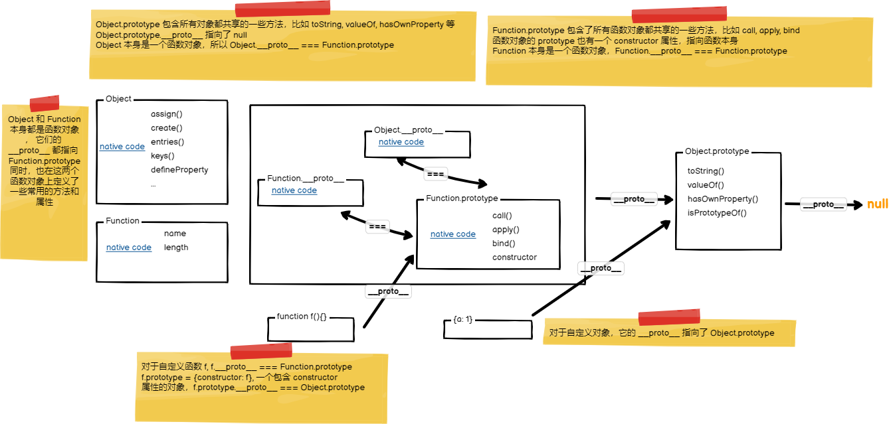

# 对象
JS 里 对象是键值对(也可以称之为属性)的无序集合，key 是字符串，值是任意类型。  
对象属性可以分为*数据属性* 和 *访问器属性*
## 数据属性
数据属性具有 4 个描述其行为的内部特性，称之为
* configurable -> 表示属性是否可删除，可修改特性描述, 默认为 true. 如果为 false, 表示该属性不可被删除，且 writable 只能从 true 修改为 false, 不能从 false 修改为 true， enumerable 也不可以再被修改
* enumerable -> 属性是否可枚举, 默认为 true
* writable -> 属性的值是否可修改, 默认为 true
* value -> 属性的值，默认为 undefined

如果想修改属性的默认特性，必须通过 *Object.defineProperty(obj, propName, propDescriptor)* 来定义
## 访问器属性
访问器属性也有 4个内置的特性
* configurable
* enumerable
* set -> setter 函数
* get -> getter 函数
```js
Object.defineProperty({}, 'name', {
    value: 'yang liu',
    enumerable: false
})

Object.defineProperty({}, 'fullName', {
    get: function() {
        return this.lastName + this.firstName
    }
})
```
## 属性访问
* obj.prop -> prop 会被解析为字符串，但是 prop 不能是 number, 比如 a.1 就不行
* obj[prop] -> prop 可以是字符串，number, 甚至是变量，会在运行时动态解析为变量的值

## Object 函数
* Object.keys(obj) -> 返回 obj 所有 own ***enumerable*** properties 的名字
* Object.getOwnPropertyNames(obj) -> 返回 obj 所有 own 的 properties name
* Object.create(obj) -> 以 obj 为 __proto__ 创建一个空对象
* Object.assign(target, ...sources) -> 将所有 source own enumerable properties 复制给 target
* Object.defineProperty(obj, name, descriptor)
* Object.getOwnPropertyDescriptor(obj, prop)
* Object.getPrototypeOf(obj) -> 返回 obj 的 __proto__ 属性
* Object.setPrototypeOf(obj, proto) -> 设置 obj 的 __proto__ 属性
* Object.freeze(obj) -> 冻结 obj 的所有属性，不允许修改，删除，添加属性, 属性的描述符也不可以修改
* Object.seal(obj) -> 密封一个对象，将该对象的所有属性的 configurable 描述符置为 false, 且不可以再往该对象上添加属性。此时，如果属性 writable 为 true, 还可以继续更新属性的 value
* Object.isExtensible(obj) -> 检查一个对象是否可以添加属性
```js
Object.prototype.toString.call([])//[object Array]
Object.prototype.toString.call(function sum(){})//[object Function]
Object.prototype.toString.call(1)//[object Number]
Object.prototype.toString.call(false)//[object Boolean]
Object.prototype.toString.call('')//[object String]
Object.prototype.toString.call({})//[object Object]
Object.prototype.toString.call(/\\/g)//[object RegExp]
Object.prototype.toString.call(null)//[object Null]
Object.prototype.toString.call(undefined)//[object Undefined]
```
## __proto__ & prototype
每个对象都有 __proto__ 属性，指向一个对象，一般来讲，会指向创建该对象的构造函数的 prototype.  
每个函数都有 prototype 属性，该 prototype 对象默认会有一个 constructor 属性，指向函数本身。  
自定义函数本身也是一个对象，也具有 __proto__ 属性，该属性指向 Function.prototype, 因为 函数对象其实是 Function 的实例。  
值得注意的是 Function.__proto__ 也指向 Function.prototype, Function.prototype.__proto__ 指向 Object.prototype  
而 Object.__proto__ 也指向 Function.prototype

### 原型链继承
之前也讲过，JS 原型链是 JS 类型继承的基础。  
```js
function Parent() {

}
Parent.prototype.eat = function() {}

function Child() {

}

Child.prototype = new Parent()
Child.prototype.constructor = Child;
```
通过 原型实现继承，也有一些缺点
* 所有子类实例共享父类属性, 任意子类实例修改父类属性后，其它实例也会受到影响
* 子类构造函数没办法传递参数给父类
* 无法实现多继承

### 构造继承
构造继承的主要思想，是在子类的构造函数里，调用父类的构造函数，从而能将父类的属性绑定在子类对象上。
```js
function Parent() {

}
Parent.prototype.eat = function() {}

function Child() {
    Parent.call(this)
}
```
构造继承解决了原型链继承的问题，但是也引入了新的问题
* 子类的实例只是子类的实例，而不是父类的实例，因为父类的 prototype 并没有被绑定
* 只能继承父类的属性，而不能继承父类的 prototype
* 父类中的 function property 会在子类的所有实例中都有一个独立的实例，造成不必要的浪费

## typeof
typeof 检查参数类型比较局限，对于对象类型，只能区分 object 和 function

## Object.prototype.toString
Object.prototype.toString 是增强版的 typeof, 不仅能识别基础类型，函数，还能识别内置类型
```js
const toString = Object.prototype.toString

toString.call(new Date()) // [Object Date]
toString.call(1) // [Object Number]
toString.call(null) // [Object Null]
toString.call() // [Object Undefined]
toString.call({}) // [Object Object]
```
## instanceof
instanceof 实际上就是检查原型链
```js
function isInstanceOf(obj, Func) {
    const target = Func.prototype// 如果 instanceof 为真，那么 obj 的原型链上一定包含 Func.prototype
    const source = obj.__proto__// 从 obj 当前的 __proto__ 开始查找
    while(true) {
        if (source === null) {//如果已经查找到了头还没有匹配
            return false;
        } else if (source === target) {
            return true
        }
        source = source.__proto__
    }
}
```
上述代码有一点小问题，比如 Func 不一定有 prototype 属性，或者 obj 的 __proto__ 本身是 null 或者 undefined.
比如 *Object.create(null)* 返回的就是一个 __proto__ === undefined 的空对象
### instanceof 的一些特殊案例
```js
// Object 本身是函数对象，Object.__proto__ === Function.prototype
// Function.prototype 是一个普通对象
// Function.prototype.__proto__ === Object.prototype
Object instanceof Object// true

// Function 本身是函数对象，所以Function.__proto__ === Function.prototype
Function instanceof Function // true

// Foo 是一个函数对象， Foo.__proto__ === Function.prototype
// 然后 Function.prototype.__proto__ === Object.prototype, 所以 Foo instanceof Foo 为 false
function Foo(){}
Foo instanceof Foo// false

// String 是函数对象 String.__proto__ === Function.prototype
String instanceof String
```

# 属性修饰符
JS 里对象的属性其实都是有隐式的配置的，这些配置包含
```js
{
    value?: any,

    configurable?: boolean // 属性的配置是否可修改，可删除。如果是 false, 则表示该属性 enumerable 不可改，且该属性不可被删除，writable 只能从 true 改为 false
    enumerable?: boolean // 属性是否可枚举
    writable?: boolean // 属性是否可改

    set?(v: any):void
    get?():any
}
// 定义对象的属性配置
Object.defineProperty(obj, name, {

})

Object.defineProperties(obj, {})

// 获取对象属性的描述符
Object.getOwnPropertyDescriptor(obj, name)
Object.getOwnPropertyDescriptors(obj)
```

对于 class 类上定义的 getter, setter, 其实也是有描述符的, 只是该属性是属于类，而不是实例
```js
class Person {
    firstName = '';
    lastName = '';

    get fullName() {

    }
}

Object.getOwnPropertyDescriptor(Person.prototype, 'fullName');

{
    configurable: true,
    enumerable: false,
    get(){},
    set: undefined,
}
```
我们怎么快速安全的 copy 一个对象呢？copy 一个对象，不仅仅是需要 copy 这个对象自己 own 的属性，还需要继承它的原型链
```js
const a = {
    x: 1,
    y() {
        return this.x + 1;
    }
}

function clone(obj) {
    // 首先，新建的对象会和  obj 拥有相同的 __proto__, 那么就继承了原型链
    // 其次，把 obj 所有的 own 的 property descriptor 也传递给新建的对象
    return Object.create(Object.getPrototypeOf(obj), Object.getOwnPropertyDescriptors(obj))
}
```