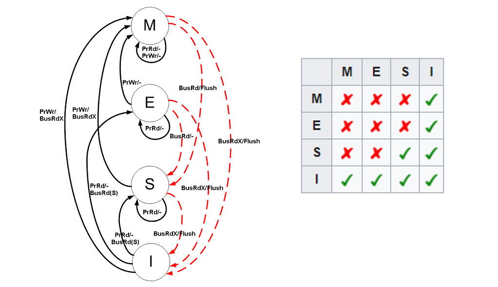
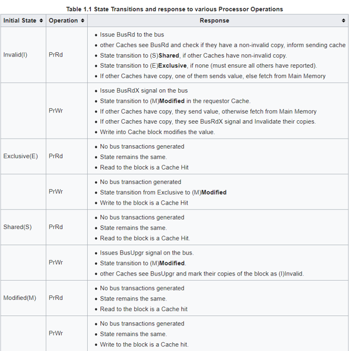
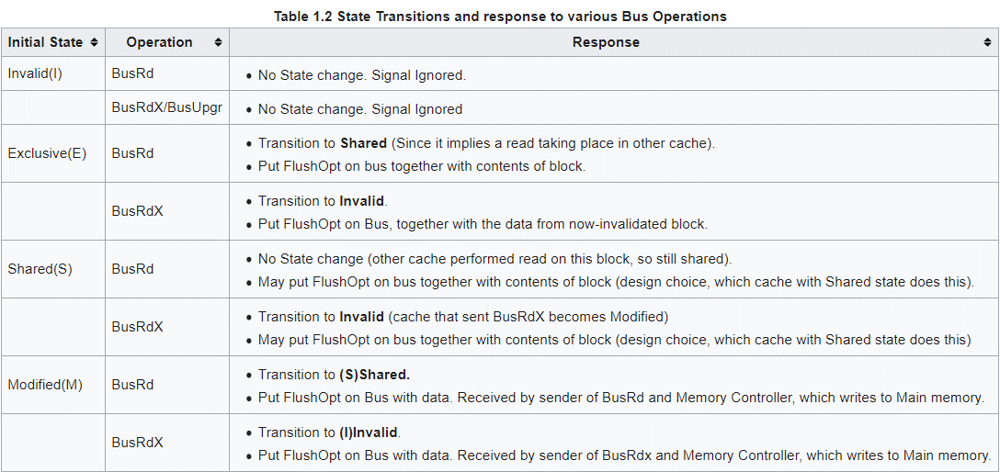
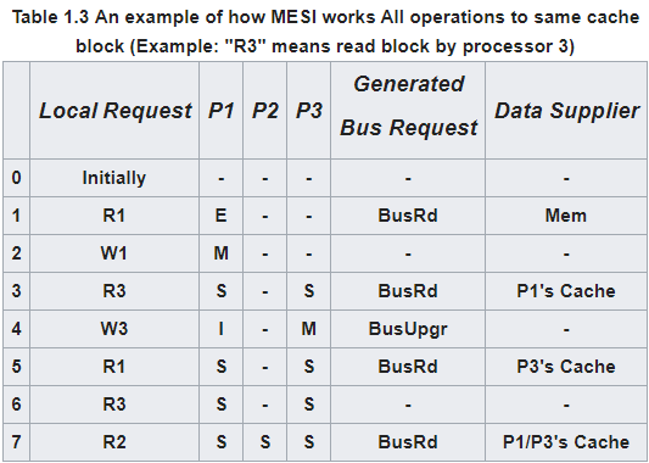
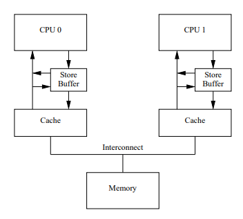
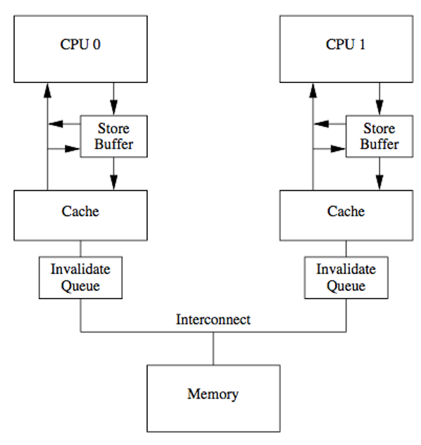

Introduction to MESI

# Table of contents
- [Definition](#definition)
  - [Events](#events)
  - [Handle PrRd/PrWr](#prrd-prwr)
  - [Handle bus events](#bus-events)
  - [Example](#example)
- [Disadvantage of MESI](#disadvantage-mesi)
  - [Store Buffer](#store-buffer)
  - [Invalidate queue](#invalidate-queue) 
- [Conclusion](#conclusion)

# Definition <a name="definition"/>
The MESI protocol is an invalidate-based cache coherence protocol, and is one of the most common protocol which support write-back caches.
1. Modified(M): only valid in current cache, and is dirty, other cache can not access its responding cache line
2. Exclusive(E): only valid in current cache, but is clean
3. Shared(S): be stored in other caches, and is clean
4. Invalid(I): invalid


对于M状态， 因为 MESI 支持 write-back, 这个dirty 的 cache entry 会在之后的某个时间点写回主存。如果在此期间， 有其它的 core 要访问同一 cache entry 地址， 当前 core 会接收到这一事件，并且将dirty 的cache entry 写回到主存，并且将该 cache line 标记为 shared.
对于E状态， 如果其它 core 要读这个 cache line, 则将状态改为 share. 如果当前core 要写该 cache line, 则将状态改为 M. E的作用在于，如果CPU 想给 S状态的cache line 写，那么必须发出 bus 信息让其它 cache invalidate. 但是如果给E状态的写，则不需要bus transaction.
对于S状态，如果其它 core 修改了它的 cache line, 则当前 core 的该cache line 会被标记为 Invalid
对于I状态，表示当前cache entry invalid 且 unused, 可以被优先 replace

## Events <a name="events" />
cache entry 的状态可以根据不同的事件进行更新。

Event Name  | Comment
------------| -------
PrRd | processor request to read a cache entry
PrWr | processor request to write a cache entry
BusRd | another processor request to read a cache entry
BusRdX | another processor which does not have the entry in the cache request to write the cache entry
BusUpgr | another processor which have the entry in cache request to write the cache entry
Flush | an entire cache entry is written back to main memory by another processor
Flushopt | an entire block is posted on the bus in order to supply it to another processor(cache to cache transfer)


对于bus event, 有的书本也有另外一套称呼

Event Name | Comment
-----------| -------
Read | another processor request to read a cache entry(same to BusRd), the message contain the physical address of the cache line
Read Response | the message contain the data requested by an earlier Read message, its supplied by either main memory or another cache
Invalidate | the message contain the physical address of cache line to be invalidated, all other caches need to invalidate there copies
Invalidate Acknownledge |  A CPU recieve Invalidate message must repsond with Invalidate Acknownledge message after invalidate their copies
Read Invalidate | the combination of Read and Invalidate
Writeback | the message contain both the data and its physical address to be written back to memory or another CPU cache

M 和 E 的状态总是精确的， 但是S不是。 当其它 S cache entry 被它们的cache discard时，它们并不会通知当前 cache, 则当前的cache entry事实上是 Exclusive，但是它的状态仍然是S。

## Handle PrRd/PrWr <a name="prrd-prwr" />
处于不同状态的 cache entry 在处理自己处理器 event 时的 response 如下表所示


## Handle bus events <a name="bus-events" />
处于不同状态的 cache entry 在处理其它处理器发出的 event 时的response 如下表所示


## Example <a name="example" />
An example to show how MESI works


1. 首先 P1 发出 PrRd, 发现cache 中没有，则给 bus 发出 BusRd. 因为其它 cache 都没有该 cache line, 则将状态改为 E, 并且通过 memory controller 从主存中读取数据。
2. P1 发出 PrWr, 将当前 cache entry 状态改为 M
3. P3 发出 PrRd, 发现自己没有该 cache entry, 则发出 BusRd, P1 接收到该信息后，将自己的 cache entry 标记为 S,且通过 memory controller 将 cache entry 同步到主存，并且将cache entry 发给 P3
4. P3 发出 PrWr, 将状态改为 M, 并且发出 BusUpgr. P1 接收到后，将自己的 cache entry 标记为 I
5. P1 发出 PrRd, 发现是 Invalid, 则发出 BusRd, P3 接收到后，将自己的 cache entry 标记为 S, 通过 memory controller 写回内存，并且通过 bus 发给 P1
6. P3 发出 PrRd, 发现自己 cache entry 是 S, 则直接读取返回
7. P2 发出 PrRd, 然后发出 BusRd, P1 或者 P3 接收到这个事件，将自己的 cache entry 发给 P2

# Disadvantages of MESI <a name="disadvantage-mesi" />
MESI protocol 也有自己的缺点， 
1. 当 write/read invalid cache entry 时，可能需要等待很久，因为要stall 直到收到所有其它 CPU 的 invalidation acknownledge.这是发送端的阻塞。
2. 当需要 invalidate cache entry in own cache, 也可能需要花费很长时间。这是接收端的阻塞。

## Store buffer <a name="store-buffer" />
为了解决问题 #1， 引入 store buffer


如果当前 core 并不own 想写入的 cache line, 即该 cache line 不在 当前core cache 里面，或者状态不为 E 或者 M, 为了写入值， 当前 core 需要发出 read-invalidate 信号来 invalidate 其它 core, 这时需要stall 来等待其它 core 的 ACK. 这样会消耗很多时间。为了避免这种情况，引入了 store buffer. 当前core 可以先把 write 写入 store buffer, 发出 read-invalidate 信号后继续执行之后的命令，无需等待该信号返回。这样就可以节省很多 CPU 之间通信的时间。然后异步等待其它 CPU 的响应， 当响应时，将store buffer apply to cache.
但是这种策略也引入了另一个问题: 由内存系统引起的重排序。 参考以下代码示例：
```java
void foo(void) {
  a = 1;
  b = 1;
}

void bar(void) {
  while (b == 0) continue;
  assert (a == 1);
}
```
<details>
  <summary>A possibility of sequence of operations</summary>
  
  假设 CPU0 执行 foo(), CPU1 执行 bar(). 且变量 a 只在 CPU1 cache 里，变量 b 只在 CPU0 cache 里。
  
  1. CPU0 执行 a = 1, 发现 a 不在cache 里，因此发出 read-invalidate 信号， 然后将 a=1 写入 store buffer
  2. CPU1 执行 while (b == 0), 因为 CPU1 does not own b cache line, 因此发出 read 信号
  3. CPU0 执行 b = 1, 发现 own b cache line, 且状态为 M or E, 因此简单将 b = 1 写入自己的 cache line
  4. CPU0 接收到 read 信号， 将自己 b cache line 状态改为 S, 且打包 b cache line, 发出 read response
  5. CPU1 接收到 read response, 将 b cache line 写入自己 cache
  6. CPU1 执行 while (b == 0), 发现 b = 1, check 为假，因此跳出循环
  7. CPU1 执行 assert(a == 1), 读取 a cache line, 发现 a = 0, 则 asert fail
  8. CPU1 接收到 read-invalidate 信号， 将 a cache line invalidate, 并且发送 invalidate acknownledge 和 a cache line
  9. CPU0 接收到 invalidate acknownledge 和 response data, apply store buffer to received cache line
  
  上述执行顺序是可能的，由于 CPU1 未能及时处理 invalidation 信号，导致程序乱序
</details>

硬件本身解决不了上述问题，因为它不知道每个内存操作在多线程下的关系，因此硬件提供了内存屏障命令供软件开发者使用，以便告诉硬件各个内存操作之间的关系。
```java
void foo(void) {
  a = 1;
  //插入写屏障
  sfence();
  b = 1;
}

void bar(void) {
  while (b == 0) continue;
  assert (a == 1);
}
```
sfence 会强制 CPU flush its store buffer before applying each subsequent store to its variables's cache line. CPU 可以简单 stall 直到清空 store buffer, 也可以使用 store buffer hold subsequent stores util all of the prior entries in the store buffer had been applied.

<details>
  <summary>A possibility of sequence of operations with sfence</summary>
  
  假设 CPU0 执行 foo(), CPU1 执行 bar(). 且变量 a 只在 CPU1 cache 里，变量 b 只在 CPU0 cache 里。
  
  1. CPU0 执行 a = 1, 发现 a 不在 cache, 则发出 read-invalidate 信号， 并将 a = 1 写入 store buffer
  2. CPU1 执行 while (b == 0), 发出 read 信号
  3. CPU0 执行 sfence, 将现在 store buffer 中的所有 entry 打上标记
  4. CPU0 执行 b = 1, 发现 store buffer 中有标记的 entry, 因此将 b = 1 写入 store buffer. 此时 b cache line 状态为 E or M
  5. CPU0 接收到 read 信号， 将 b cache line 状态改为 S, 打包发出。 注意此时 cache line 中 b 的值仍是 0.
  6. CPU1 接收到 read response, 将 b cache line 写入cache, 由于 b = 0, 继续执行循环
  7. CPU1 接收到 read invalidate 信号， 将 a cache line invalidate, 然后打包发出, 且发出 invalidate acknownledge
  8. CPU0 接收到 a cache line 和 ack, 将 a=1 apply 到cache line, 且将 a cache line 状态改为 M
  9. 因为此时 store buffer 中已经没有标记的 operation, 因此可以直接尝试 apply b=1 to cache
  10. 因为此时 b cache line 状态为 S, 因此 CPU0 发出 invalidate 信号
  11. CPU1 接收到 invalidate 信号， 将 b cache line invalidate, 并发出 invalidate acknownledge
  12. CPU0 接收到 ack, 将 b = 1 写入 b cache line, 并将状态改为 M
  13. CPU1 执行 while (b == 0), 发出 read 信号
  14. CPU0 接收到 read 信号，将 b cache line 状态改为 S, 且打包发出
  15. CPU1 接收到 read response, 将 b cache line 写入cache. b = 1, 跳出循环
  16. CPU1 发出 read 信号读取 a
  17. CPU0 接收到 read 信号，将 a cache line 状态改为 S, 并且打包发出
  18. CPU1 接收到 read response, 将 a 写入cache, 执行 assert (a == 1), success
  
  这里的区别在于 CPU0 写 b = 1时，并不是直接写入 cache line, 而是写入 store buffer, 并且必须等待 a = 1 applied 后才能 apply自己(因为 a = 1 在 store buffer 里已被标记). 意思就是即使 CPU0 先接收到 b 的 invalidate acknownledge, 也必须等待，直到接收到 a 的 invalidate acknownledge. 在此之前， CPU1 的每次 read 仍然只能拿到 b = 0(note that 因为 b = 1 仍然在 store buffer 里，CPU0 响应 b 的 read 信号时，不会返回 b = 1, 而是直接返回 cache 中的值, store buffer 里的写入被隐藏， 然后在 apply b=1 to b cache line时，因为状态是 S, 要改为 M, 需要再次发送 invalidate 信号)
</details>

## Invalidate queue <a name="invalidate-queue" />
为了解决问题 #2， 引入 invalidate queue


解决了主动发送信号端的效率问题，那么接收端 CPU 再接收到 invalidate 信号后也不是立即采取相应行动，而是把 invalidate 信号插入到一个 invalidaye queue 中，且立即返回 ACK 信号。 等待合适的时间，再去处理这个 queue 中的 invalidate. CPU 承诺在处理 invalidation queue 中的 message 之前，不会发送任何有关这个 message 所对应 cache line 的任何 MESI message. 需要注意的是，如果 CPU 中有 a 的 cache line, 并且接收到了 a 的 invalidate message, 在处理这个message 之前， CPU 仍然可以 load a, 甚至可以 write a, 只要不发出任何有关 a 的MESI message即可。因此就会有潜在的脏读现象存在。 除了脏读之外，invalidate queue 也可能造成内存重排序。
```java
void foo(void) {
  a = 1;
  //插入写屏障
  sfence();
  b = 1;
}

void bar(void) {
  while (b == 0) continue;
  assert (a == 1);
}
```
现在 enable 了 store buffer 和 invalidate queue, 对于上述示例，执行序列可能如下所示
<details>
  <summary>A possibility of sequence of operations with store buffer and invalidate queue</summary>
  
  假设 a 被 CPU0 和 CPU1 share, b own by CPU0.
  
  1. CPU0 执行 a = 1, 发出 invalidate 信号，将 a=1 写入 store buffer
  2. CPU1 接收 invalidate 信号，放入 invalidate queue, 立即返回 ACK
  3. CPU0 执行 sfence, 将 store buffer 里 entry 打上标记
  4. CPU0 接收 ACK, 将 a = 1 写入 cache line, 将状态改为 M
  5. CPU0 执行 b = 1, 直接写入 cache line
  6. CPU0 执行 while (b ==0), 发出 read 信号。(即使在#5 之前发出 read, 拿过来的值也是0, 并且将状态改为 S, 之后 #5 就会发出 invalidate 信号)
  7. CPU0 接收 read 信号， 将 b 状态改为 S, 并打包发出
  8. CPU1 接收到 read response, 将 b 写入 cache,然后跳出循环
  9. CPU1 执行 assert (a ==1), 发现 a cache line 是 S, load 后 assert fail. (此时， CPU0 里面 a cache line 是 M, 值为1, 但是 CPU1 还没有处理 invalidate queue, 因此出现脏读)
  10. CPU1 处理 invalidate queue, 标记 a cache line invalidate, 但是为时已晚。
  
  另外一种可能性
  
  5. CPU1 执行 while (b == 0), 发出 read 信号
  6. CPU0 接收 read 信号，将 b cache line 状态改为 S, 且打包发出。 此时 b = 0
  7. CPU1 接收到 read response, 写入cache, 继续执行循环
  8. CPU0 执行 b = 1, 发现 b cache line 状态是 S, 发出 invalidate 信号，将 b = 1 写入 store buffer
  9. CPU1 接收到 invalidate 信号， 放入 invalidate queue, 立即返回 ACK.
  10. CPU0 接收到 ACK, 将 b =1 写入cache line, 状态改为 M
  11. CPU1 处理 a invalidate 信号， 将 a cache line invalidate
  12. CPU1 处理 b invalidate 信号， 将 b cache line invalidate
  13. CPU1 发出 read 信号
  14. CPU0 将 b 状态改为 S, 打包发出
  15. CPU1 接收 read response, 写入 cache, 跳出循环
  16. CPU1 发出 read 信号
  17. CPU0 将 a 状态改为 S, 且打包发出
  18. CPU1 接收到 read response, assert success
  
  可见， 加入 invalidate queue 后， 内存系统引起的重排序仍然可能发生。
</details>

为了解决这个问题，需要使用更多的内存屏障，那就是读屏障 lfence
```java
void foo(void) {
  a = 1;
  //插入写屏障
  sfence();
  b = 1;
}

void bar(void) {
  while (b == 0) continue;
  lfence()
  assert (a == 1);
}
```
lfence 会让CPU 标记当前 invalidate queue里的所有 entry, 强制要求CPU 之后所有的 load 操作必须等待 invalidate queue 里面被标记的 entry 真正应用到缓存后才能执行。加入 lfence 后，程序执行顺序可能如下所示
<details>
  <summary>A possibility of sequence of operations with lfence</summary>

  假设 a 被 CPU0 和 CPU1 share, b own by CPU0.
  
  1. CPU0 执行 a = 1, 写入 store buffer, 并且发出 invalidate 信号
  2. CPU1 执行 while (b == 0), 发出 read 信号
  3. CPU1 接收到 invalidate 信号， 放入 invalidate queue, 且立即返回 ACK
  4. CPU0 执行 sfence, 标记当前 store buffer entry
  5. CPU0 接收到 ACK, apply store buffer to cache, 将 a cache line 状态改为 M
  6. CPU0 执行 b = 1, 因为 b own by CPU0, 且现在 store buffer 中没有标记的entry, 所以直接写入 cache line
  7. CPU0 接收到 read 信号， 将 b cache line 状态改为 S, 且打包发出
  8. CPU1 接收到 read response, 将 b 写入 cache, 跳出循环
  9. CPU1 执行 lfence, 标记当前 invalidate queue
  10. CPU1 在执行 assert 之前，必须要处理 invalidate queue, 因此会 invalidate  a cache line, 然后再发 read 信号， 最后 assert 成功
  
  区别在于 lfence 会迫使 CPU 在执行后续 load 之前必须清空当前 invalidate queue, 这样 a 就会被及时 invalidate.
</details>

但是sfence 和 lfence 并不是万能的， 在一些特定的 CPU 架构下，需要更 heavy 的内存屏障

# Conclusion <a name="conclusion" />
CPU 之所以不按照代码顺序执行命令，一方面是 CPU 为了执行效率和性能，避免无谓等待，接受了多核 CPU 下的代码乱序，这是一种设计妥协。另一方面是编辑器为了执行效率，避免不合理的代码逻辑，也会对代码指令进行重排序。 重排序是呈现给开发者的表象，而内存可见性是指令乱序的另一种表现。

CPU 在不断追求效率的同时，其架构也在不停演化。不管是 store buffer, 还是 invalidate queue, 甚至包括 message queue, 这些组件的引入无疑是在一步步摆脱 CPU 性能的束缚。频率越高，越不能接受无谓的 I/O 等待，解决无谓的等待就意味着要引入额外的高速 cache 元件加以缓冲，同时，也不可避免的进一步增加数据不一致的可能。解决这些问题，就需要引入内存屏障，内存屏障多种多样，在不同平台下甚至有不同实现，使用这些内存屏障又势必会制约 CPU 的性能发挥。而这，就需要我们开发者因场景而异，做出权衡。

