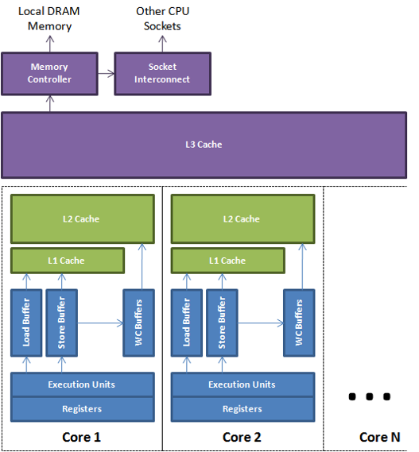
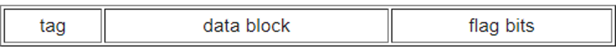
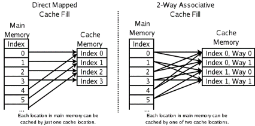
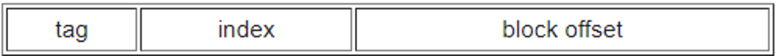
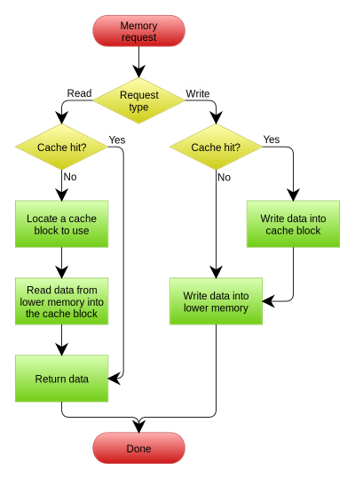
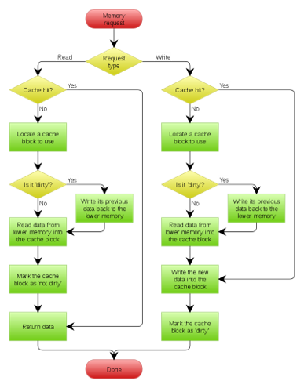

Introduction to cache

现在 CPU 大量使用 cache, 下面是计算机 cache 的大致分布。每一个 core 有自己的 L1 和 L2 cache, 所有的 core 共享 L3 cache. 但是这种分布并不绝对，不同的计算机可能有不同分布方式。

数据在主存和 cache 之间是以固定大小传输的，一般一个 cache line 的长度为64 bytes, 当一个cache line 从内存 copy 到 cache 时，一个 cache entry 会被创建。 cache entry 被用来管理 cache line。 当 CPU 尝试 read/write data 时，首先检查该data 对应的地址是否包含在 cache中，如果包含(cache hit), 则直接操作 cache, 这样就避免了访问主存，如果不在(cache miss),则会创建一个新的 cache entry, 然后从主存中 load data 到 cache 中，之后在这个 cache entry上继续操作。

## cache entry
一个 cache entry 包含 data block 和一个标记该 cache line 在主存中地址的 tag, 和该 cache entry 状态的 flag bit 三部分。

data block 存储cache line 的data, 一般是 64 bytes. 且 cache 的大小就是 block size * number of blocks, 并不计算 tag 和 flag的大小。
当 CPU 访问一个物理地址时，需要知道该物理地址对应的 cache entry 在 cache 的什么位置， 这就涉及到了 cache associative.

## cache associative
一个cache entry 能够被放在一个cache 的什么位置，是有一定规则的，称之为 cache associative. 一个 cache 一般被分为多个 set, 如果每个 set 可以存放N个 cache entry, 则称为 N-Way Associative. 

更高的 associativity 意味着一个 cache entry 可以尽可能的被缓存而不用频繁被抢位置然后被弹出，但是同时，也意味着当 CPU 想 check 一个物理地址是否在 cache 中时，总是需要遍历更多的cache entry, 这也带来了更多的消耗。如上图所示，当 CPU 想 load 主存地址 0,1,3,4时，对于direct map, load 4时需要弹出0, 对于2-way, 则不用弹出任何已有的 cache line. 但是如果想 check 4 是否在 cache 中，则需要遍历两个 cache entry.

## memory address mapping
因为 cache line 总是和它的 memory address 一一对应，且是 unique 的，则直接通过物理地址来计算该 cache line 应该被放在 cache 的什么位置，是最为简单有效的。 举例说明，一个 cache, 大小是 8kb, block size 是64 bytes, 且是 4-way. 那么 set 的个数是 8K/64bytes/4 = 32. 那么为了区分属于哪个 set,则需要log32 =5 个bit. 又因为 block size是 64 bytes, 为了区分一个物理地址对应于该行 block 的具体哪个字节，则需要 log64=6 个 bit. 为了快速根据物理地址算出分配坐标，直接将物理地址进行分解。 

Index 用来寻找 set, block offset 用来寻找该行中的具体字节，剩下的字节则是 tag, 用来区分可以放进同一个set 的 address.
对于上例来说，从零地址**00000**``000000``到 **00000**``111111``是第一个cache line, 且该 cache line 将会进入 set0, 且之间地址所对应的字节都可以通过block offset 来确定。 **00001**``000000`` 到**00001**``111111``是第二个 cache line, 将会进入set1. 每个物理地址除了作为 index 和 block offset 剩下的所有bit 作为 tag. 随着物理地址的增大，下一个进入 set0 的地址是 1**00000**``000000``, 因为前一个进入的cache line 的tag 是00， 现在进入的是 01, 则可以通过 tag的不同来区分不同的 cache line.
总的来说，当 CPU 访问一个物理地址时，首先根据地址的 set part bits 来找到对应的 set, 然后遍历 set 中的所有 entry, check 是否有 entry 的 tag 和物理地址的 tag part match. 如果有，则表示该地址在cache 中。 之后还需要通过 flag bits check 该 cache entry 的状态。 一般 flag bits 中包含 valid bit 和 dirty bit. 在多处理器中，如果一个处理器修改了一个共享变量，其它处理器会将自己 cache 中对应的 cache entry 标记为 invalid. dirty bit 用在 write back 模式中，标记该 cache entry 已经被修改过，但是还没有同步到主存。通过所有check 后，则 cache hit.
如果 cache miss, 则需要从主存里重新load data. 这时需要通过 replacement algorithm 来选择一个 entry 弹出以便放置新的 cache entry.

## write policy
CPU write data to cache 后， 必须在之后某个时间点将 data 同步到主存，这个时间点的选择称为 write policy.
1. write-through: 同时写入 cache 和主存
2. write-back: 先写入 cache, 标记该 cache line dirty, 在该 cache entry 将被 replace 或者其它系统安排的时间点写回主存
3. write-allocate: write/read miss 后，创建 cache entry, load data, 然后继续操作。 
4. no-write-allocate: write miss 后，并不创建cache entry, 而是直接写回主存。read miss 后，会创建cache entry.

一般, write-back 会使用 write-allocate 模式处理 write miss, write-through 会使用 no-write-allocate 模式处理 write miss
需要注意的是，在多处理器中，对共享变量的 write 也有不同的处理方式。
1. write-invalidate: 对当前处理器的 write 会广播给其它处理器，并让其它处理器标记含有该共享变量的 cache entry 为 invalid, 则其它处理器在下一次访问该 cache entry时，需要从主存中重新 load(也可以从别的 cache 中读取，具体方式取决于缓存一致性的实现， 比如 MESI， P1 的 write 只写回 cache, P2 可以发消息直接从 P1 的cache 中读取 cache line)
2. write-update: 对当前处理器的写会广播给其它处理器，且直接更新该处理器里共享变量的值

## cache coherence
当不同处理器 cache 了相同 cache line 时，其中一个处理器对共享变量的修改，该怎么对其它处理器可见，这是缓存一致性协议所负责的事情。
缓存一致性承诺：
1. Write Propagation: Change to the data in any cache must be propagated to other copies in the peer caches
2. Transaction serialization: Read/Write to a single memory location must be seen by all processors in the same order.

其中 #1 保证了任意处理器对共享变量的修改能被其它处理器探知， 但这个保证并不足够保证缓存一致性。比如有4个处理器P1,P2,P3,P4, 缓存了同一个共享变量S， 初始值为0。然后P1 在某个时刻将S修改为10, P2 跟着将S修改为20. 在时间序列上，S先被 P1 修改为10， 再被P2 修改为20. 根据#1，这两个修改都将会被 P3, P4 探知。但是P3 可能先探知 P2 对S的修改，再探知P1 对S的修改，从而判断S=10，P4 则相反，从而判断S=20， 那么现在缓存也不一致了。 从而需要 #2 来规定，对同一地址的写应该有序。换句话说，如果共享变量 S 从两个处理器接收到 两个不同的值 A 和 B, 那么其它处理器绝对不能先读到 B 再读到A。
