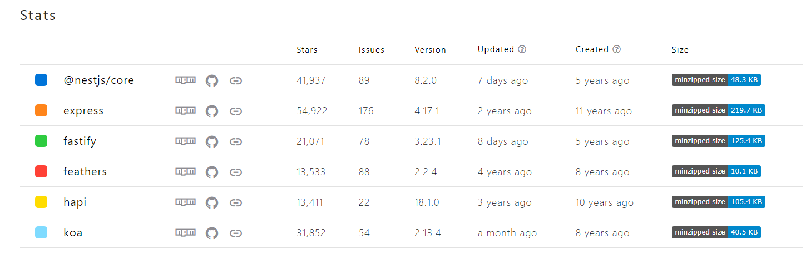

List the popular backend web development platform with Node.js.

# Express
* GitHub stars: 55k
* NPM weekly downloads: 18m
* Written in: pure JS
* License: MIT

Express 是最稳定，使用最久的 Node.js 框架，首次发布在2010, 紧跟在 Node.js 之后。  
Express 封装了 Web application 基础的功能，提供所有的 HTTP 方法，和大量的中间件以便快速构建 REST API.  
cons: Express.js has a lot of complex programming that becomes a tedious task for beginners to build an efficient API.

# Fastify
* GitHub stars: 21k
* NPM weekly downloads: 350k
* Written in: JS and TS
* License: MIT

Fastify 专注于提高 app 性能和速度，同时在服务器运行期间节约资源。 
通过定义的 hook, plugins, decorators, 该框架同样实现了轻量级，高扩展性，高弹性。 它能够 server up to 76+ thousand requests per second.

# Nest
* GitHub stars: 42k
* NPM weekly downloads: 1m
* Written in: TS
* License: MIT

Nest 发展很迅速，越来越多的人选择使用 Nest.  
Nest aims to provide an application architecture out of the box which allows for the effortless creation of highly testable, scalable, loosely coupled, and easily maintainable applications. The architecture is heavily inspired by Angular. 

# Koa
* GitHub stars: 31k
* NPM weekly downloads: 1.2m
* Written in: JS
* License: MIT

Koa 由 Express 团队开发，意在打造更小，更富有表现力，更鲁棒的 Web application 平台。  
通过使用 async function, Koa allows you to ditch callbacks and greatly increase error-handling.  
Koa does not bundle any middleware within its core  
Koa provides an elegant suite of methods that make writing servers fast and enjoyable.

# Hapi(@hapi/hapi)
* GitHub stars: 13k
* NPM weekly downloads: 470k
* Written in: TS
* License: BSD-3-Clause

Hapi is good enough for the development of secure real-time scalable and social media applications. Thus, developers use it for the building of the proxies and API service. 
Some developers may face issues due to the Code Readability. So, if there’s a necessity to speed up the development process, one shouldn’t use Hapi.

# Feature(@feathersjs/feathers)
* GitHub stars: 13k
* NPM weekly downloads: 40k
* Written in: JS & TS
* License: MIT

Feathers is a lightweight web-framework for creating real-time applications and REST APIs.  
Feathers can interact with any backend technology, supports over a dozen databases and works with any frontend technology like React, VueJS, Angular.  
Some developers find the issue with the original code. Also, developers who have lesser knowledge regarding fixing the original code issues shouldn’t opt for Feather.js.