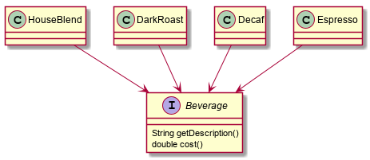

# Sample

1. 星巴克订单系统. 星巴克提供多种饮料，比如各种各样的咖啡，果汁等等，每种饮料有自己的价格
2. 每种饮料可以添加多种调料，比如摩卡，冰糖，奶泡等。
3. 每种饮料有小杯，中杯，大杯之分，添加的调料的价格也要根据饮料的大小改变

# Class diagram

1. Beverage

2. Beverage + Condiment

3. Beverage + Size

# Question

1. 添加一种饮料，或者添加一种调料
2. 饮料的价格，或者调料的价格有了改动
3. 有的调料并不适用于某些饮料
4. 有的调料想要多份

# Conclusion

为了扩展现有类的行为，可以采用继承或者组合的形式。继承类会继承父类所有的行为，且所有类在编译期就决定了。如果可变量较多，那么就需要很多的子类，类数量爆炸，且基类的改变可能并不适用于所有的子类， 导致维护成本提高。如果采用组合的形式，就可以在运行时动态的进行扩展，甚至赋予现有类之前不具有的功能。这就需要使用装饰者模式。
装饰者模式动态的将责任附加到对象上，若要扩展功能，装饰者提供了比继承更有弹性的替代方案。
1. 装饰者和被装饰者必须具有相同的超类型，任何需要原始对象的场合，都可以使用装饰对象替代
2. 可以使用多个装饰者装饰同一个装饰对象
3. 装饰者可以在被装饰者的行为之前与/或之后加上自己的行为，以达到特定目的， 也可以添加新的行为
4. 对象可以在任何时候被装饰，所以可以在运行时动态的，不限量的使用装饰者来装饰对象
5. 如果代码依赖于具体对象类型，则慎用装饰者模型，因为对象类型已经被改变
6. 装饰者模式会产生很多小的对象，增加了复杂度，不好管理。可以引入工厂模式或者 Builder 模式来创建对象
7. 当需要访问装饰链条上所有装饰者时，会比较麻烦
