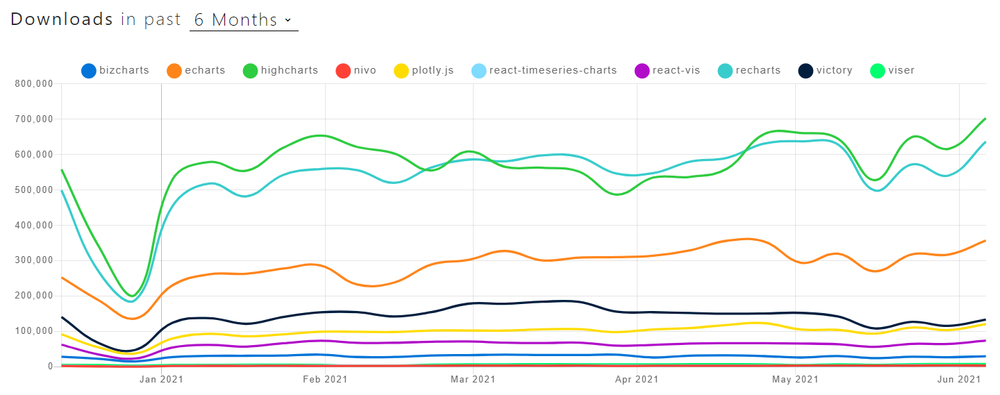
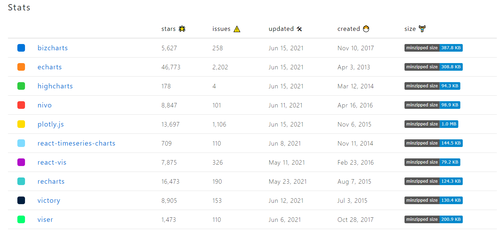
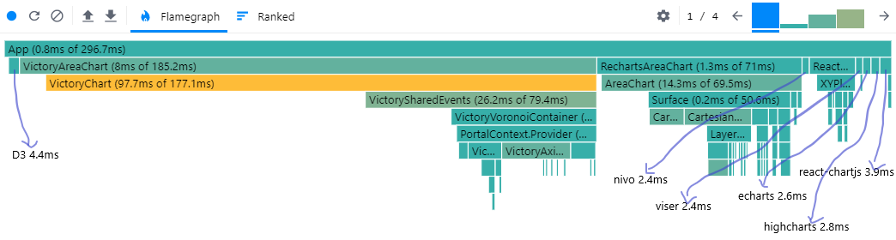
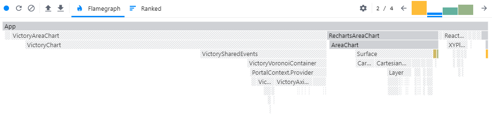
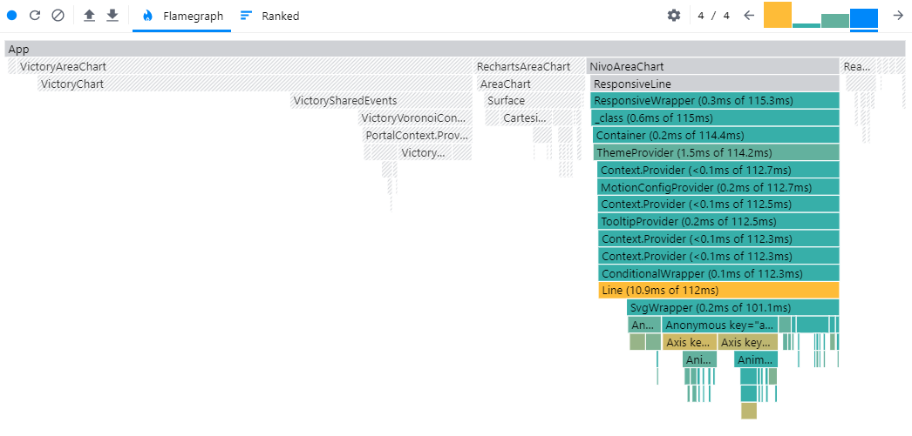

# Compare React Chart Library

You can homebrew your charts in React without relying on any chart libray, however, considering the time you will need to spend developing and maintaining the code, its clear why a popular and well-maintained chart library for React is the way to go.

Then there come a question: which React chart library should we shoose?

In addition to the features a chart library provides, we should take into account

* the quality of documentation
* the impact on performance
* support interaction, support 3D, support Zoom/Brush
* library dependencies, library size
* the cost of license and support

## D3
D3 allow you to bind arbitrary data to a DOM, and then apply data-driven transformations to the document to create interactive SVG charts with smooth transitions and interaction.

Why not suggest use D3 in React directly:
1. Hard to learn and implement
2. D3 will manipulate the DOM directly, which conflict with React

[source link](./react-chart-compare/src/charts/D3AreaChart.js)

## [recharts](https://github.com/recharts/recharts)
### SVG render | Responsive Charts | Types available | No zoom/brush | [User Guide](https://recharts.org/en-US/guide)
One of the oldest and most reliable chart library available for React is [recharts](http://recharts.org/).

This library support <b>SVG</b>, with only light dependency on some D3 submodules, it use declaraive components, with the components of charts purely presentational.

It has active developer community, and it is usually the first library to consider when looking for data visualization library for React application

[source link](./react-chart-compare/src/charts/RechartsAreaChart.js)

## echarts
### SVG, Canvas render | Types available | Zoom/brush available | [User Guide](https://echarts.apache.org/examples/en/index.html)
echarts need a react wrapper, <code>echarts-for-react</code> too, its usage is simple

[source link](./react-chart-compare/src/charts/EChartsAreaChart.js)

## highcharts
### SVG render | Types available | Zoom/brush available | [User Guide](https://www.highcharts.com/demo)
Highcharts need a react wrapper, named <code>highcharts-react-official</code>

[source link](./react-chart-compare/src/charts/HighChartsAreaChart.js)

## plotly
### SVG, Canvas render | Types available | Zoom/brush available 
<code>react-plotly.js</code> is the react wrapper for plotly.js, the plotly.js has huge size.

[source link](./react-chart-compare/src/charts/PlotlyChartArea.js)

## [viser](https://viserjs.gitee.io/)
### Canvas | Types available | Zoom/brush available | Build on G2 | [User Guide](https://viserjs.gitee.io/demoHome.html)
Viser is a promising visualization library for the three most popular frameworks — React, Vue, and Angular.  it has a gread demo page where you can find answers to the majority of your questions. The demo page has an interactive coding box where you can observe the code along with the data that shapes the graph. you can also change and run the code snippet to see the changes. 

[source link](./react-chart-compare/src/charts/ViserAreaChart.js)

## [react-chartjs-2](https://github.com/jerairrest/react-chartjs-2)
react-chartjs-2 is a React wrapper for a popular JS chart library [chartjs](https://www.chartjs.org/).

Chartjs is a lightweight chart library that let you build responsive chart components by using HTML5 <b>Canvas</b> elements, and is known to be beginner-friendly.

[source link](./react-chart-compare/src/charts/ReactChartStackBar.js)

## [Victory](https://github.com/FormidableLabs/victory)
### SVG render | Responsive Charts | Typs available | Zoom/brush available | Available for Web and Mobile application
Victory is a set of modular charting components for React and React Native. It use same API for web and React Native applications for easy cross-platform charting.

[source link](./react-chart-compare/src/charts/VictoryAreaChart.js)

## [nivo](https://github.com/plouc/nivo)
### SVG,Canvas,Server render | Responsive Charts | No zoom/brush
Another collection of React components on top of D3.js is nivo. What make nivo unique for React is its ability to render on server side, and it offer both <b>SVG</b> and HTML <b>Canvas</b> charts in a single library. 

[source link](./react-chart-compare/src/charts/NivoAreaChart.js)

## [react-vis](https://github.com/uber/react-vis)
### SVG, Canvas | Responsive Charts | Types available | Zoom/brush available | [User Guide](http://uber.github.io/react-vis/website/dist/storybook/?knob-X%20Axis=true&knob-Y%20Axis=true&knob-vertical%20gridlines=true&knob-horizontal%20gridlines=true&selectedKind=Series%2FAreaSeries%2FBase&selectedStory=Single%20Area%20chart&full=0&addons=1&stories=1&panelRight=0&addonPanel=storybooks%2Fstorybook-addon-knobs)
react-vis is a collection of React components to render common data visualization charts, which include line/area/bar charts, heat map, scatter plot, contour plot, hexagon heatmap, pie and donut charts, sunbursts, radar charts, parallel coordinates, and tree maps.

[source link](./react-chart-compare/src/charts/ReactVisAreaChart.js)

## [BizCharts](https://github.com/alibaba/BizCharts)
BizCharts is developed by AliBaba, it offer charting for business application based on G2 and React. It support ES6 React syntax and boast an impressive template library.

Whats more, the documentation and gallery itself are in Chinese.

[source link](./react-chart-compare/src/charts/BizAreaChart.js)

## [react-timeseries-chart](https://github.com/esnet/react-timeseries-charts)
### [User Guide](http://software.es.net/react-timeseries-charts/#/guide/start)
This library focus on time series components, such as network traffic data. Lower level elements are constructed using D3.js, while higher level composability is provided by React.

[source link](./react-chart-compare/src/charts/ReactTimeSeriesCurrencyChart.js)

## Overall Compare
### The Downloads

### The Stats

### Profiler
#### Commit 1

#### Commit 2

#### Commit 3

#### Commit 4

