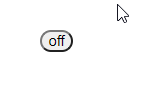

# 过渡和动画
Vue 支持在插入，移除，更新 DOM 时，提供多种不同方式的应用过渡效果。  
## 单元素、组件的过渡
```html
<button @click="show=!show">click</button>
<transition name="fade">
  <p v-if="show">this is a paragraph</p>
</transition>
```
当插入、删除包含在 <code>transition</code> 组件里的元素时， 
1. vue 会自动嗅探目标元素是否应用了 CSS 过渡或动画，如果是，则在合适的时机添加/删除 CSS 类名。  
2. 如果过渡组件提供了 JS 钩子函数，这些钩子函数将在合适的时机被调用
3. 如果没有找到 CSS 过渡/动画，也没有找到 JS 钩子函数，则 DOM 操作会在下一帧立即运行

## 过渡的类名
如果 transition 指定了 name, 那么过渡类名将以 name 为前缀，如果没有，则以 *v* 为前缀。  
对于进入、离开的过渡，有以下 6 个 class 切换  
1. v-enter, 在元素插入 DOM 之前生效，插入后的下一帧移除. 相当于赋给过渡元素的初始状态。
2. v-enter-active, 在整个进入过渡的阶段中应用，在插入之前就生效，在过渡完成之后移除。这个 class 用来定义进入过渡的过程时间，延迟和曲线函数。
3. v-enter-to, 定义进入过渡的结束状态。在元素被插入之后下一帧生效(与此同时，v-enter 被移除)， 在过渡完成完成之后移除
4. v-leave, 定义离开过渡的开始状态，在离开过渡被触发时立刻生效，在下一帧被移除
5. v-leave-active, 定义离开过渡生效时的状态。在离开过渡被触发时立刻生效，在过渡完成之后移除。这个 class 可以用来定义离开过渡的过程时间，延迟和曲线函数。
6. v-leave-to, 定义离开过渡的结束状态。在离开过渡被触发之后下一帧生效(与此同时，v-leave 被移除), 在过渡完成后移除。

## 自定义过渡的类名
为了方便直接使用其它三方CSS定义的动画类，可以为 *transition* 指定自定义类名，such as <code>\<transition enter-active-class="animated tada">\</transition></code>
* enter-class
* enter-active-class
* enter-to-class
* leave-class
* leave-active-class
* leave-to-class

它们的优先级高于普通的类名。
## 过渡元素的初始渲染
上面的过渡只会在元素插入/移除时触发，但是在元素首次渲染时，并不会触发过渡。为了给初始渲染添加过渡，可以为*transition* 元素添加 *appear* 属性。  
它也支持自定义 CSS 类名
* appear-class
* appear-active-class
* appear-to-class

这样，在初始渲染该元素时，也会 apply transition.
## 过渡钩子函数
Vue support 在过渡动画进行的过程添加 hook 函数，这些钩子函数可以和 CSS 过渡/动画结合使用，也可以单独使用。  
```xml
<transition
  v-on:before-enter="beforeEnter"
  v-on:enter="enter"
  v-on:after-enter="afterEnter"
  v-on:enter-cancelled="enterCancelled"

  v-on:before-leave="beforeLeave"
  v-on:leave="leave"
  v-on:after-leave="afterLeave"
  v-on:leave-cancelled="leaveCancelled"
>
  <!-- ... -->
</transition>
```
对应的 JS code
```js
methods: {
  // --------
  // 进入中
  // --------

  beforeEnter: function (el) {
    // ...
  },
  // 当与 CSS 结合使用时， 回调函数 done 是可选的
  enter: function (el, done) {
    // ...
    done()
  },
  afterEnter: function (el) {
    // ...
  },
  enterCancelled: function (el) {
    // ...
  },

  // --------
  // 离开时
  // --------

  beforeLeave: function (el) {
    // ...
  },
  // 当与 CSS 结合使用时，回调函数 done 是可选的
  leave: function (el, done) {
    // ...
    done()
  },
  afterLeave: function (el) {
    // ...
  },
  // leaveCancelled 只用于 v-show 中
  leaveCancelled: function (el) {
    // ...
  }
}
```
如果只使用 JS hook 函数完成过渡，则在 enter 和 leave 钩子中必须调用 done() 函数，否则它们将被同步调用，过渡会立即完成。  
而且，为了避免 CSS 对过渡的影响，可以 <code>\<transition :css="false">\</transition></code> 

## 多个元素的过渡
当使用了 *v-if*, *v-else* 时，一个元素的进入，就肯定伴随着一个元素的离开。  
Vue 里 *\<transition>* 的默认行为是 进入和离开同时发生，即同时对进入元素 apply 进入过渡，对离开元素 apply 离开过渡。 
但这种效果有时候不满足需求，可以通过属性 *mode* 来修改。  
*in-out* 表示先 apply 进入过渡，再 apply  离开过渡，这意味着可以同时看到两个元素存在，一般不常用。  
*out-in* 表示先 apply 离开过渡，再 apply 进入过渡，这样看起来会比较丝滑。

  
为了达到这种效果
```html
<transition mode="in-out">
  <button v-if="show" key="first" class="fix-position">on</button>
  <button v-else key="second" class="fix-position">off</button>
</transition>
```
```css
button {
  border-radius: 10px
}

.fix-position {/* 保证两个button 处于同一位置，才会有button 重叠在一起的动画效果*/
   position: absolute;
   top: 150px;
   left: 40px;
 }
.v-enter {/*从右边，透明 进入*/
  transform: translate(20px, 0);
  opacity: 0
}

.v-enter-active, .v-leave-active {
  transition: all 1s linear
}

.v-leave-to {/*往左平移，变透明，离开*/
  transform: translateX(-20px);
  opacity: 0
}
```
### 多个组件的过渡
多个组件的过渡可以直接使用动态组件。
```html
<transition name="fade" mode="out-in">
  <component :is="currentView"></component>
</transition>
```
```js
new Vue({
  data() {
    return {
      currentView: 'compA'
    }
  },
  components: {
    compA,
    compB,
    compC
  }
})
```
```css
.fade-enter, .fade-leave-to {
  opacity: 0
}

.fade-enter-active,.fade-leave-active {
  transition: all 1s ease
}
```
## 列表过渡
前面讲了怎么渲染 v-if 和 v-else 的单个或两个节点，那么对于 v-for 列表，该怎么渲染呢。这个时候，就要使用 <code>\<transition-group></code>.  
这个组件相对于 <code>\<transition></code> 有一些不同的特性。
* 这个组件会渲染为一个真实元素，默认是一个 *span*, 可以通过 *tag* attribute 更换为其它元素
* 过渡模式不可用，因为不再是切换元素。
* 内部元素必须提供唯一的 key 值
* CSS 过渡的类将会作用到内部添加或者删除的元素中，而不是这个 group 本身

一个简单的示例
```html
<div id="list-demo" class="demo">
  <button v-on:click="add">Add</button>
  <button v-on:click="remove">Remove</button>
  <transition-group name="list" tag="p">
    <span v-for="item in items" v-bind:key="item" class="list-item">
      {{ item }}
    </span>
  </transition-group>
</div>
```
```js
new Vue({
  el: '#list-demo',
  data: {
    items: [1,2,3,4,5,6,7,8,9],
    nextNum: 10
  },
  methods: {
    randomIndex: function () {
      return Math.floor(Math.random() * this.items.length)
    },
    add: function () {
      this.items.splice(this.randomIndex(), 0, this.nextNum++)
    },
    remove: function () {
      this.items.splice(this.randomIndex(), 1)
    },
  }
})
```
```css
.list-item {
  display: inline-block;
  margin-right: 10px;
}
.list-enter-active, .list-leave-active {
  transition: all 1s ease;
}
.list-enter, .list-leave-to {
  opacity: 0;
  transform: translateY(30px);
}
```
上面的示例有一个问题，只有添加/删除的元素有过渡动画，其它保留的元素会立即移动到它们的新位置，而不是平滑的过渡。
### 列表的排序过渡
<code>\<transition-group></code> 除了有添加\删除元素的进入\离开 动画，还可以支持保留元素移位的动画，它的类名是 *v-move*, 类似于 *v-enter*, *v-leave-to*.  
如果想使用自定义类名，类似于 *enter-class*, *leave-active-class*, 保留元素移位的类名为 *move-class*.  
这样，不论是添加还是删除元素，或者将元素换位，对每一个位置改变的元素，都会有动画效果显示。  