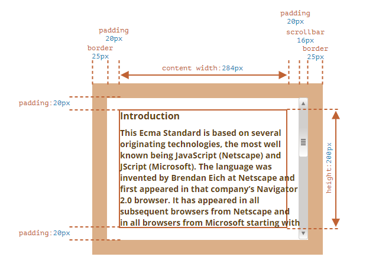
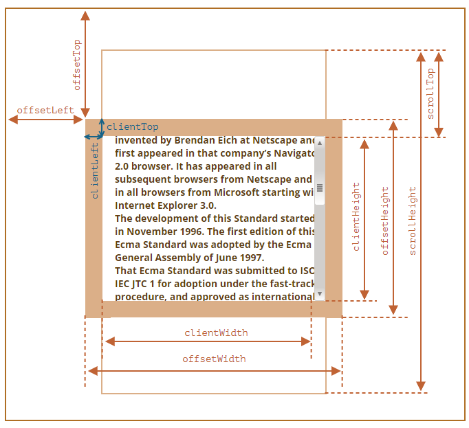

# Element Size & Scroll
元素在布局后，会有自己的布局信息，比如元素宽度，高度和其它几何特征信息。
```html
<div id="example">
  ...Text...
</div>
<style>
  #example {
    width: 300px;
    height: 200px;
    border: 25px solid #E8C48F;
    padding: 20px;
    overflow: auto;
  }
</style>
```
  
元素的布局需要考虑 border, padding, 滚动条。需要注意的是，在元素文本较多时，padding 区域并不会显示空白，而是被用来显示文本。  
该元素在 window 中的布局信息如下  
  
需要注意
* 这些数字的单位都是 pixel
* 如果在 CSS 里指定了 width,height, 它指定的其实是 content 和 scrollbar 加起来的宽度和高度 
* 如果元素未显示，那么它的几何信息都是 null/0

## offset
* offsetParent 指向距离当前元素最近的 定位祖先元素。如果元素 display:none, 如 offsetParent 为 null
* offsetLeft, 当前元素左上角相对于 offsetParent 的左边界偏移的像素值
* offsetTop, 当前元素左上角相对于 offsetParent 上边界偏移的像素值
* offsetHeight, 当前元素的高度，包括边界，padding, 水平滚动条(如果显示的话)
* offsetWidth, 当前元素的宽度，包括 边界，padding, 垂直滚动条(如果显示的话)

## Client
* clientLeft, 元素左 border 的宽度
* clientTop, 元素上 border 的宽度
* clientWidth, 元素内部宽度，包括 padding, 但不包括 border, 以及 垂直滚动条
* clientHeight, 元素内部高度，包括 padding, 但不包括 border, 以及水平滚动条

## Scroll
scroll 属性还考虑了隐藏的部分，需要注意的是，scrollLeft 和 scrollTop 是可改的
* scrollWidth, 内容在水平方向完全显示的宽度，如果没有水平滚动条，那么 scrollWidth 就等于 clientWidth.
* scrollHeight, 内容在垂直方向完全显示的高度，如果没有垂直滚动条，那么 scrollHeight 就等于 clientHeight.
* scrollLeft, 是元素在水平方向滚动，隐藏的部分的宽度
* scrollTop, 是元素在垂直方向滚动，隐藏的部分的高度, 换句话说就是已经滚动了多少


