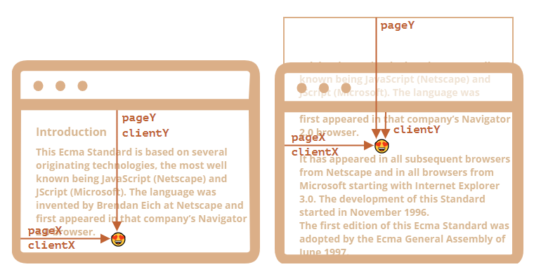

# position
大多数的 JS 处理以下两种坐标系
1. 相对于 window. 类似于 *position:fixed* 时元素的坐标，总是相对于窗口左上角来设置的。通常用 clientX/clientY 表示
2. 相对于 document. 类似于 *position:absolute*, 是相对于 document root 的左边。通常用 pageX/pageY 表示

当元素所在页面滚动时，元素在窗口的相对位置发生改变，所以 clientX/clientY 会发生变化，但 pageX/pageY 是相对于文档的，即使已经滚动隐藏，但是仍然会被计算。  
  

# elem.getBoundingClientRect
该方法会返回 DOMRect, 表示元素的矩形窗口坐标
* x/y => 矩形 box 相对于窗口的 X/Y 坐标
* width/height, 元素的宽度，高度，可以为负数
* left/right, 元素矩形 box 左右边界相对于窗口的坐标
* top/bottom  

   
需要注意的是，
1. 坐标可能会是小数。
2. 坐标也可能是负数，比如当元素滚动隐藏之后
3. right/bottom 和 CSS 里的定义不一样

# document.elementFromPoint(x, y)
会返回在窗口坐标 (x, y) 处嵌套最深的那个元素。 对于窗口之外的元素，返回 null

# conclusion
页面上任何元素都有坐标
1. 相对于窗口的坐标 => getBoudingClientRect
2. 相对于document 的坐标 => getBoudingClientRect + 滚动距离

窗口坐标非常适合和 *position:fixed* 一起使用，文档坐标适合和 *position:absolute* 一起使用

