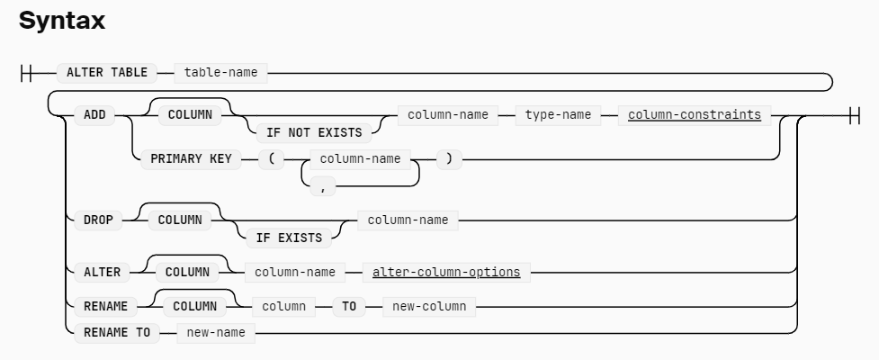

# Alter
很多时候需要对数据进行修改
```sql
CREATE TABLE integers (i INTEGER, j INTEGER);

-- 添加列
ALTER TABLE integers ADD COLUMN k INTEGER DEFAULT 0;

-- 删除列
ALTER TABLE integers DROP k

-- 重命名
ALTER TABLE integers RENAME TO integers_old

-- 对列重命名
ALTER TABLE integers RENAME COLUMN c1 TO c2

-- 改变列的 type
ALTER TABLE integers ALTER i TYPE VARCHAR

-- 改变列的 type 的同时更新值
ALTER TABLE integers ALTER i SET DATA TYPE VARCHAR USING concat(i, '_', j);

-- 改变 列的默认值
ALTER TABLE intergers ALTER COLUMN i SET DEFAULT 10

-- 删掉列的默认值
ALTER TABLE intergers ALTER COLUMN i DROP DEFAULT
-- 修改列的 constraint
ALTER TABLE integers ALTER COLUMN i SET NOT NULL;
ALTER TABLE integers ALTER COLUMN i DROP NOT NULL;
-- 添加 primary key constraint
ALTER TABLE integers ADD PRIMARY KEY (i, j);
```


对于 view 来说，只支持 修改 view 的名字
```js
ALTER VIEW v1 RENAME TO v2;
```