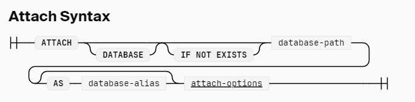

# Attach
有的时候需要连接外部数据库， 这个时候就需要使用 attach 语句  

 attach 会允许 duckdb 同时操作多个 database, 也可以在多个 database 里传输数据
 ```sql
-- database name 会被解析为 file
ATTACH 'file.db';

ATTACH 'file.db' AS file_db (READ_ONLY, TYPE SQLITE);

-- add database prefix
CREATE TABLE file_db.new_table (i integer)

-- detach database
DETACH IF EXISTS file_db

-- 指定默认使用的 database
USE data

-- 显示当前 使用的 databases
SHOW DATABASES
```