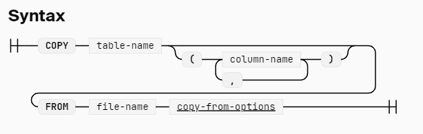

# Copy
copy 用来在 duckdb 和 external files 直接 move data. copy from 从外部文件 load 数据，copy to 导出数据到文件

# copy from
从外部文件导入数据到已经存在的 table 里。数据会被 appended. 如果不指定 columns, 那么文件的 列和 table 的 列需要匹配，而且数据可以转换。  
如果指定了 columns, 那么只会 load 文件里指定的 columns
```sql
-- copy 的时候需要带上 header
COPY category FROM 'categories.csv' (HEADER);

-- 文件的内容会被插入到 category table 里的 name 列，其它列填充默认值
COPY category(name) FROM 'names.csv';

COPY lineitem FROM 'lineitem.parquet' (FORMAT PARQUET);
COPY lineitem FROM 'lineitem.json' (FORMAT JSON, ARRAY true);
```


# copy to
导出 duckdb 数据到外部文件，数据可以是 table，也可以是 query 
```sql
COPY lineitem TO 'lineitem.tsv' (DELIMITER '\t', HEADER false);

COPY (SELECT 42 AS a, 'hello' AS b) TO 'query.parquet' (FORMAT PARQUET);

-- options 在指定时需要使用 括号 包裹起来
-- 常用的 option 有 
--   FORMAT,支持 csv/parquet/json. 
--   OVERWRITE_OR_IGNORE 是否允许 overwrite, 需要和 partition by 一起使用
--   FILENAME_PATTERN 指定生成文件的 pattern, 需要和 partition by 一起使用
--   FILE_EXTENSION 指定文件后缀
--   PARTITION_BY 生成一个 hive partition 的结构

-- 导出到 csv/parquet/json 时，还有更详细的配置
```

# copy from database ... to
从一个 database copy 到另一个 database
```sql
ATTACH 'db1.db' AS db1;
CREATE TABLE db1.tbl AS SELECT 42 AS x, 3 AS y;
CREATE MACRO db1.two_x_plus_y(x, y) AS 2 * x + y;

ATTACH 'db2.db' AS db2;
-- 会 copy db1 里面的所有东西
COPY FROM DATABASE db1 TO db2;
SELECT db2.two_x_plus_y(x, y) AS z FROM db2.tbl;

-- 只 copy schema
COPY FROM DATABASE db1 TO db2 (SCHEMA);
```