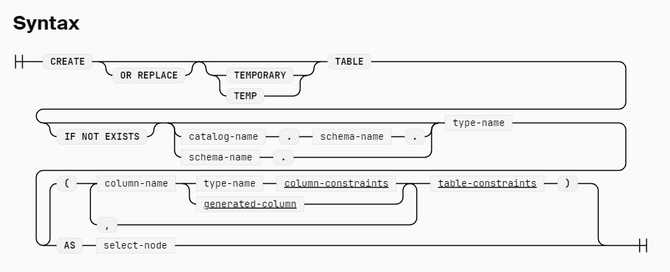

# Create Table
创建一个新的 table, 在创建的时候，可以指定列的 类型，default value, 以及 primary key, 和一些其它的 constraints
```sql
CREATE TABLE t1 (id INTEGER PRIMARY KEY, j VARCHAR);

CREATE TABLE t1 (id INTEGER, j VARCHAR, PRIMARY KEY (id, j));

-- 给 decimalnr 列添加一个 check
-- check constraint 是该列每一行的值都需要满足的约束，在插入时，如果不满足，则会抛错
CREATE TABLE t1 (
    i INTEGER NOT NULL,
    decimalnr DOUBLE CHECK (decimalnr < 10),
    date DATE UNIQUE,
    time TIMESTAMP
);

-- create table from selection
CREATE TABLE t1 AS
    SELECT 42 AS i, 84 AS j;

-- just copy the schema of t2 to t1 
CREATE TABLE t1 AS
    FROM t2
    LIMIT 0;

-- create temp table
CREATE TEMP TABLE t1 AS
    SELECT *
    FROM read_csv('path/file.csv');

-- create or replace
-- 在不存在时创建，已存在时替换
CREATE OR REPLACE TABLE t1 (i INTEGER, j INTEGER);

-- 如果不存在，才会创建
CREATE TABLE IF NOT EXISTS t1 (i INTEGER, j INTEGER);

-- 添加 constraint, check 也可以作为约束的一部分
CREATE TABLE t3 (
    id INTEGER PRIMARY KEY,
    x INTEGER,
    y INTEGER,
    CONSTRAINT x_smaller_than_y CHECK (x < y)
);
INSERT INTO t3 VALUES (1, 5, 10);
INSERT INTO t3 VALUES (2, 5, 3);

-- 外键约束
-- 往 t2 插入数据时，如果 t1_id 并不存在于 t1 中，则该次插入会失败
-- 通常设置外键约束会降低性能，大多数情况下，应用不设置外键约束，而是需要自己通过逻辑来确保行为正确
CREATE TABLE t1 (id INTEGER PRIMARY KEY, j VARCHAR);
CREATE TABLE t2 (
    id INTEGER PRIMARY KEY,
    t1_id INTEGER,
    FOREIGN KEY (t1_id) REFERENCES t1 (id)
);

CREATE TABLE t3 (id INTEGER, j VARCHAR, PRIMARY KEY (id, j));
CREATE TABLE t4 (
    id INTEGER PRIMARY KEY, t3_id INTEGER, t3_j VARCHAR,
    FOREIGN KEY (t3_id, t3_j) REFERENCES t3(id, j)
);

-- 派生列
-- 有的时候，有的列是通过其它列派生得到的，它不可以被直接插入，只能通过计算得出
-- 指定 column type, 表示为 generated, virtual 表示该列并不会被存储到 disk, 只会在被 select 时，计算得出。
CREATE TABLE t1 (x FLOAT, two_x FLOAT GENERATED ALWAYS AS (2 * x) VIRTUAL);
-- 简写为
CREATE TABLE t1 (x FLOAT, two_x AS (2 * x));
```


# Create view
创建 view 相对简单很多
```sql
-- 从 selection 创建 view, 当 tbl 更新时，view 也会更新
CREATE VIEW v1 AS SELECT * FROM tbl;

CREATE OR REPLACE VIEW v1 AS SELECT 42;

create view if not exists v1 as select * from data

-- 查看 view 本身的 sql 语句， duck_views() 会返回当前所有的 view 的列表
SELECT sql FROM duckdb_views() WHERE view_name = 'v1';
```

# Create Index
 索引是一种数据结构，类似于 b-tree, r-tree 等，它用来存储列的值的信息。有的索引是有顺序的，比如 b-tree, 可以快速的定位到查询的行。

 ```sql
 -- unique index 表示所指定的列的值需要是  unique 的，可以包含 null
 -- 它和 primary key 有区别，主键其实不是索引，而是约束，主键一定对应着 unique index, 但是 unique index 并不一定是主键，且 table 只能有一个主键，可以有多个唯一索引
 -- 主键也不允许有 null 值
 create unique? index name on table (columns)
 
 drop index name
 ```

 # Create Sequence
 sequence 就是一个 数字生成器
 ```sql
 create sequence serial; -- start from 1
 create sequence serial start 101; -- start from given number
 -- 可以指定步长， with 是 optional, by 也是 optional 
 CREATE SEQUENCE serial START WITH 1 INCREMENT BY 2;
 -- 步长也可以是负数， 且可以指定最大值, 最小值
 CREATE SEQUENCE serial START WITH 99 INCREMENT BY -1 MAXVALUE 99;
 -- 甚至可以允许 重复的生成数字
 CREATE SEQUENCE serial START WITH 1 MAXVALUE 10 CYCLE;

 create or replace sequence serial;
 create sequence if not exists serial;

 drop sequence serial;
 drop sequence if exists serial
 ```
 sequence 的使用，可以作为自增主键
 ```sql
 CREATE SEQUENCE id_sequence START 1;
 -- nextval('id_sequence') 用来获取下一个值
CREATE TABLE tbl (id INTEGER DEFAULT nextval('id_sequence'), s VARCHAR);
INSERT INTO tbl (s) VALUES ('hello'), ('world');
-- id 列就会自动填充 1， 2

-- 也可以用于 alter table
CREATE TABLE tbl (s VARCHAR);
INSERT INTO tbl VALUES ('hello'), ('world');
CREATE SEQUENCE id_sequence START 1;
ALTER TABLE tbl ADD COLUMN id INTEGER DEFAULT nextval('id_sequence');
-- 一次性添加

-- 还可以使用 currval('id_sequence') 来获取当前值，但是在调用 currval 之前，必须已经调用过 nextval
 ```