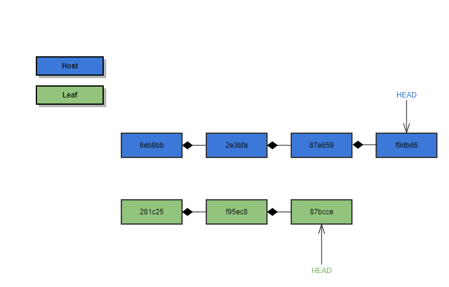
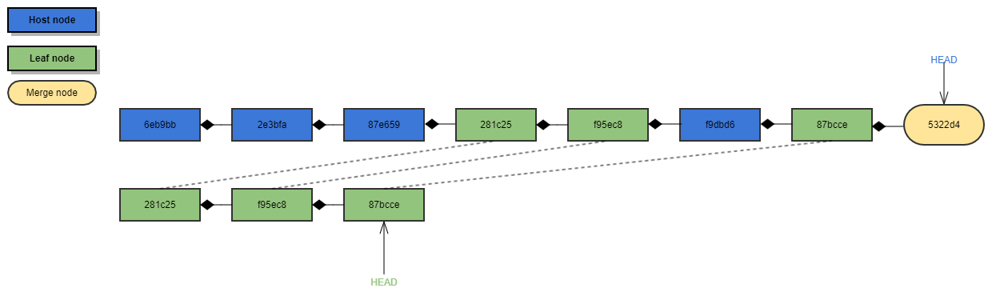
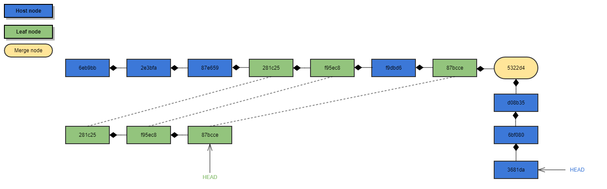
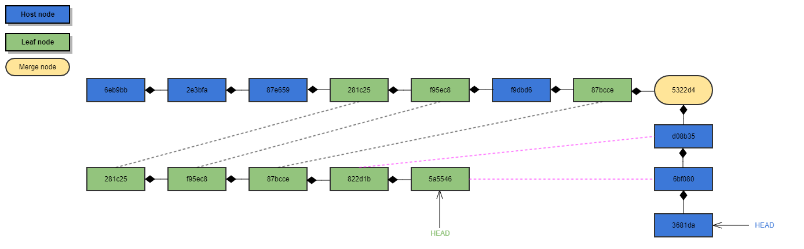
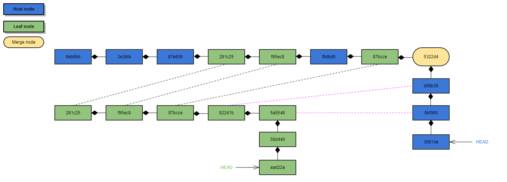
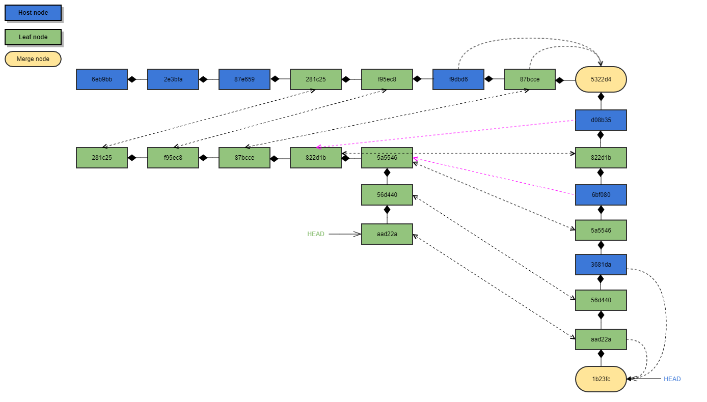

# Introduction to git subtree.

## Git subtree help
```bash
-bash-4.1$ git subtree
usage: git subtree add   --prefix=<prefix> <commit>
   or: git subtree add   --prefix=<prefix> <repository> <ref>
   or: git subtree merge --prefix=<prefix> <commit>
   or: git subtree pull  --prefix=<prefix> <repository> <ref>
   or: git subtree push  --prefix=<prefix> <repository> <ref>
   or: git subtree split --prefix=<prefix> <commit...>

    -h, --help            show the help
    -q                    quiet
    -d                    show debug messages
    -P, --prefix ...      the name of the subdir to split out
    -m, --message ...     use the given message as the commit message for the merge commit

options for 'split'
    --annotate ...        add a prefix to commit message of new commits
    -b, --branch ...      create a new branch from the split subtree
    --ignore-joins        ignore prior --rejoin commits
    --onto ...            try connecting new tree to an existing one
    --rejoin              merge the new branch back into HEAD

options for 'add', 'merge', and 'pull'
    --squash              merge subtree changes as a single commit
```

## Usage case
1. Sometimes, we want to split our code to separated repository and keep its commit history.
2. Sometimes, we put common code in separated repository and want to use its code in our project directly.

## How to use 
Assume that we have a repository [Host repo](https://github.com/YangLiu1024/GitSubTreeTestHostRepo), add we want to split its icons folder to [Split repo](https://github.com/YangLiu1024/GitSubTreeTestSplitRepo), and add a sub repository [Leaf repo](https://github.com/YangLiu1024/GitSubTreeTestLeafRepo).

### Split sub folder icons
the command format: `git subtree split --prefix=<path-to-sub-folder> --branch <branch-name>`

this command will extract all previously commits of sub folder to generate a new branch which named <branch-name>
  
for our case, first, cd to `Host repo` folder, then execute
```git
git subtree split -P icons --branch icons
```
  
now, a new branch `icons` which contain all previous commit history of `icons` folder is created.

### Push to new split repository
Now, create a new folder, such as `GitSubTreeTestSplitRepo`, then execute `git init` to initialize. 

Then execute  `git pull <path-to-host-repo> icons` to merge `icons` branch of host repo to new repository master branch.

Now, we got the `icons` branch in new repository, remaining work is to push it to remote repository.

`git remote add origin <url-to-new-repository>`, then `git push -u origin master`.

now, a new repository with all history commits is generated.

### Update host repository
We just created a new repository with splited code, then need to clean host repository first.
```git
git rm -rf icons
git add .
git commit -m "remove icons folder, because split it to another repository"
git push
```
now, the `icons` folder is deleted. Need to change to depend on the new created split repository

the command format: `git subtree add -P <path-to-sub-folder> <url-to-repository> <branch-name> --squash`

`<path-to-sub-folder>` is used to store the code of the `<url-to-repository>` with branch `<branch-name>`

`--squash` means merge all commits of `<branch-name>` in `<url-to-repository>` to one commits

for our case,
```git
git subtree add -P icons https://github.com/YangLiu1024/GitSubTreeTestSplitRepo.git master
```
the code of `Split repo` of branch `master` will be download to `icons` folder. 

now you will find that your branch is ahead of origin which is introduced by `git subtree add`, so need to `git push` to sync the change

### Add leaf repository
This is similar with adding `Split repo`.
```git
git subtree add -P leaf https://github.com/YangLiu1024/GitSubTreeTestLeafRepo.git master
```
now, a new folder `leaf` is created which contain the code of `Leaf repo` of branch `master`.

Finally, `git push` to sync the change.

### Push change in host repo to sub repo
User develop on host repository as usually, and they may change some files under `split repo` or `leaf repo` folder.
all things work expected as single repository. 

note that the files under `split repo` folder or 'leaf repo' folder is just synced within current host repository, the real 'Split repo' or `Leaf repo` is not impacted.

And at suitable time, user want to sync the change on `split repo` folder or `leaf repo` folder to real repository, he need to execute
```git
git subtree push -P <path-to-sub-folder> <url-to-repository> <branch-name>
```
to push the change to real sub repository.

<b>Note:</b>
* current host repo will extract all commits to `<path-to-sub-folder>` intelligently, then push to <url-to-repository> <branch-name>.
* the commit id is not consistent between host repo and sub repo, `git subtree` will create new commit which has same change, then push to sub repository
  
### Pull change in sub repo to host repo
The sub repo maybe get some update by someone others, to sync the change to host repo, need to execute
```git
git subtree pull -P <path-to-sub-folder> <url-to-repository> <branch-name>
```
note that `git pull` in host repo will only fetch the change made in host repo, if sub repo is changed by someone else, need to execute `git subtree pull` to sync

## Sample - Start from scratch
###  Add a sub repo
we have a [host repo](https://github.com/YangLiu1024/HostRepo), its git log shown as below
```bash
yangliu@LT424684 MINGW64 /HostRepo (master)
$ git log
commit f9dbd6e0d58da75db4895d9fe80256cb45678444 (HEAD -> master, origin/master, origin/HEAD)
Author: YangLiu1024 <31921184+YangLiu1024@users.noreply.github.com>
Date:   Fri Aug 28 16:40:12 2020 +0800

    host commit 4

commit 87e659a42973518f82ea85afd5faa74052805b2d
Author: YangLiu1024 <31921184+YangLiu1024@users.noreply.github.com>
Date:   Fri Aug 28 16:38:32 2020 +0800

    host commit 3

commit 2e3bfaa4924d0d060277b04be2a50a1a7075651c
Author: YangLiu1024 <31921184+YangLiu1024@users.noreply.github.com>
Date:   Fri Aug 28 16:38:07 2020 +0800

    host commit 2

commit 6eb9bba4663bb53eb6acaa361cc7a2567204b666
Author: YangLiu1024 <31921184+YangLiu1024@users.noreply.github.com>
Date:   Fri Aug 28 16:37:23 2020 +0800

    Commit 1
```
we have another [leaf repo](https://github.com/YangLiu1024/LeafRepo), its git log shown as below
```bash
yangliu@LT424684 MINGW64 /LeafRepo (master)
$ git log
commit 87bccee8b4c9c33e811e32c25b7df0378dbdd03c (HEAD -> master, origin/master, origin/HEAD)
Author: YangLiu1024 <31921184+YangLiu1024@users.noreply.github.com>
Date:   Fri Aug 28 16:40:31 2020 +0800

    leaf commit 2

commit f95ec87c93de97908603205f83b691f455a94fc7
Author: YangLiu1024 <31921184+YangLiu1024@users.noreply.github.com>
Date:   Fri Aug 28 16:39:31 2020 +0800

    leaf commit 1

commit 281c2586823863b30a65b4a9d6cb8bef06575911
Author: YangLiu1024 <31921184+YangLiu1024@users.noreply.github.com>
Date:   Fri Aug 28 16:39:00 2020 +0800

    Initial commit
```



Now, we plan to add leaf repo as sub repository of host repo
```bash
yangliu@LT424684 MINGW64 /HostRepo (master)
$ git remote add leaf https://github.com/YangLiu1024/LeafRepo.git
$ git subtree add -P leaf leaf master
```
now, check the history again, you can see that the commits history of `leaf` repo have been merged into `host` repo in <b>chronological order</b>, it just seems like the `leaf` is part of `host` from the beginning, all changed made to `leaf` is actually made to `host`.

note that the commit id is consistent here, because its just a combination of two independent repository.
```bash
yangliu@LT424684 MINGW64 /HostRepo (master)
$ git log
commit 5322d43436aa94e7799b3e99a453ff594696ed6f (HEAD -> master)
Merge: f9dbd6e 87bccee
Author: YangLiu1024 <shipiaopiao1115@gmail.com>
Date:   Fri Aug 28 16:43:37 2020 +0800

    Add 'leaf/' from commit '87bccee8b4c9c33e811e32c25b7df0378dbdd03c'

    git-subtree-dir: leaf
    git-subtree-mainline: f9dbd6e0d58da75db4895d9fe80256cb45678444
    git-subtree-split: 87bccee8b4c9c33e811e32c25b7df0378dbdd03c

commit 87bccee8b4c9c33e811e32c25b7df0378dbdd03c (leaf/master)
Author: YangLiu1024 <31921184+YangLiu1024@users.noreply.github.com>
Date:   Fri Aug 28 16:40:31 2020 +0800

    leaf commit 2

commit f9dbd6e0d58da75db4895d9fe80256cb45678444 (origin/master, origin/HEAD)
Author: YangLiu1024 <31921184+YangLiu1024@users.noreply.github.com>
Date:   Fri Aug 28 16:40:12 2020 +0800

    host commit 4

commit f95ec87c93de97908603205f83b691f455a94fc7
Author: YangLiu1024 <31921184+YangLiu1024@users.noreply.github.com>
Date:   Fri Aug 28 16:39:31 2020 +0800

    leaf commit 1

commit 281c2586823863b30a65b4a9d6cb8bef06575911
Author: YangLiu1024 <31921184+YangLiu1024@users.noreply.github.com>
Date:   Fri Aug 28 16:39:00 2020 +0800

    Initial commit

commit 87e659a42973518f82ea85afd5faa74052805b2d
Author: YangLiu1024 <31921184+YangLiu1024@users.noreply.github.com>
Date:   Fri Aug 28 16:38:32 2020 +0800

    host commit 3

commit 2e3bfaa4924d0d060277b04be2a50a1a7075651c
Author: YangLiu1024 <31921184+YangLiu1024@users.noreply.github.com>
Date:   Fri Aug 28 16:38:07 2020 +0800

    host commit 2

commit 6eb9bba4663bb53eb6acaa361cc7a2567204b666
Author: YangLiu1024 <31921184+YangLiu1024@users.noreply.github.com>
Date:   Fri Aug 28 16:37:23 2020 +0800

    Commit 1
```


git will create a remote branch to track `leaf/master`
```bash
yangliu@LT424684 MINGW64 /HostRepo (master)
$ git branch -a
* master
  remotes/leaf/master
  remotes/origin/HEAD -> origin/master
  remotes/origin/master
```
check the referred commit id for each branch
```bash
$ cat .git/refs/heads/master
5322d43436aa94e7799b3e99a453ff594696ed6f
$ cat .git/refs/remotes/origin/master
5322d43436aa94e7799b3e99a453ff594696ed6f
$ cat .git/refs/remotes/leaf/master
87bccee8b4c9c33e811e32c25b7df0378dbdd03c
```
note that `5322d4` is used to merge last commit `87bcce` of `leaf` and last commit `f9dbd6` of `host`.

### Modify in host repo and push to leaf repo
do some change to leaf/README.md and README.md and commit, check the log. commit `d08b35` modify both 'leaf/README.md' and 'README.md', commit `6bf080` modify 'leaf/README.md',
commit `3681da` modify 'README.md'
```bash
yangliu@LT424684 MINGW64 /HostRepo (master)
$ git log
commit 3681da0b2295159d658242d6fc8191e11e900f44 (HEAD -> master)
Author: YangLiu1024 <shipiaopiao1115@gmail.com>
Date:   Fri Aug 28 17:23:42 2020 +0800

    modify README.md from host

commit 6bf08008b33f36e12563fab86463f7502f2d4d64
Author: YangLiu1024 <shipiaopiao1115@gmail.com>
Date:   Fri Aug 28 17:19:27 2020 +0800

    modify leaf/readme from host

commit d08b35d71d6c30b95950991f594066ee3f903844
Author: YangLiu1024 <shipiaopiao1115@gmail.com>
Date:   Fri Aug 28 17:18:11 2020 +0800

    modify leaf/readme and readme from host

commit 5322d43436aa94e7799b3e99a453ff594696ed6f (origin/master, origin/HEAD)
Merge: f9dbd6e 87bccee
Author: YangLiu1024 <shipiaopiao1115@gmail.com>
Date:   Fri Aug 28 16:43:37 2020 +0800

    Add 'leaf/' from commit '87bccee8b4c9c33e811e32c25b7df0378dbdd03c'

    git-subtree-dir: leaf
    git-subtree-mainline: f9dbd6e0d58da75db4895d9fe80256cb45678444
    git-subtree-split: 87bccee8b4c9c33e811e32c25b7df0378dbdd03c

commit 87bccee8b4c9c33e811e32c25b7df0378dbdd03c (leaf/master)
```


push the change to `leaf` repository
```bash
yangliu@LT424684 MINGW64 /HostRepo (master)
$ git subtree push -P leaf leaf master
```
go to `leaf` repo, pull change, and check its hository, there are two new commits.
```bash
yangliu@LT424684 MINGW64 /LeafRepo (master)
$ git log
commit 5a5546cb5f3309fde92826ea9bc6f5ec5f7a4c2d (HEAD -> master, origin/master, origin/HEAD)
Author: YangLiu1024 <shipiaopiao1115@gmail.com>
Date:   Fri Aug 28 17:19:27 2020 +0800

    modify leaf/readme from host

commit 822d1bfaa9f20345adac50246f23bb1afdee9092
Author: YangLiu1024 <shipiaopiao1115@gmail.com>
Date:   Fri Aug 28 17:18:11 2020 +0800

    modify leaf/readme and readme from host

commit 87bccee8b4c9c33e811e32c25b7df0378dbdd03c
Author: YangLiu1024 <31921184+YangLiu1024@users.noreply.github.com>
Date:   Fri Aug 28 16:40:31 2020 +0800

    leaf commit 2
```

`822d1b` extract from `d08b35` of `host`, `5a5546` extract from `6bf080` of `host`.

note that `3681da` of `host` is not related to `leaf` folder, so git will not extract from it.

and lets check the diff between the related commits `d08b35` and `822d1b`.

you can find that the commit `d08b35` in `host` modify two files: 'README.md' and 'leaf/README.md', and the commit `822d1b` only modify the 'leaf/README.md'.
```bash
yangliu@LT424684 MINGW64 /HostRepo (master)
$ git diff d08b35
diff --git a/README.md b/README.md
index 38573f1..7921539 100644
--- a/README.md
+++ b/README.md
@@ -6,5 +6,3 @@ host commit 2
 host commit 3

 host commit 4
-
-modify from host 1
diff --git a/leaf/README.md b/leaf/README.md
index 23f8cdb..5e5a433 100644
--- a/leaf/README.md
+++ b/leaf/README.md
@@ -4,4 +4,6 @@ leaf commit1

 leaf commit 2

-modify from host 1
+modify from leaf 1
+
+modify from leaf 2
```
```bash
yangliu@LT424684 MINGW64 /LeafRepo (master)
$ git diff 822d1b
diff --git a/README.md b/README.md
index 23f8cdb..5e5a433 100644
--- a/README.md
+++ b/README.md
@@ -4,4 +4,6 @@ leaf commit1

 leaf commit 2

-modify from host 1
+modify from leaf 1
+
+modify from leaf 2
```
also, that's why the commit id is not consistent, because git need to extract the change related to `leaf` repo within specified commit.



check the referred commit of `leaf/master` in `host`, its has been updated to lastest commit id of `leaf` repository
```bash
yangliu@LT424684 MINGW64 /HostRepo (master)
$ cat .git/refs/remotes/leaf/master
5a5546cb5f3309fde92826ea9bc6f5ec5f7a4c2d
```
### Modify in leaf repo and pull from host
do some change in `leaf` repo, push to remote, and check its log. there are two new commit `56d440` and `aad22a`
```bash
yangliu@LT424684 MINGW64 /LeafRepo (master)
$ git log
commit aad22a491f6ff9066b01e371e252b0b14d099dc3 (HEAD -> master, origin/master, origin/HEAD)
Author: YangLiu1024 <shipiaopiao1115@gmail.com>
Date:   Fri Aug 28 17:50:34 2020 +0800

    modify from leaf 2

commit 56d4401df4f826fd21eaf38dd54c3f627f54e12e
Author: YangLiu1024 <shipiaopiao1115@gmail.com>
Date:   Fri Aug 28 17:50:06 2020 +0800

    modify from leaf 1

commit 5a5546cb5f3309fde92826ea9bc6f5ec5f7a4c2d
Author: YangLiu1024 <shipiaopiao1115@gmail.com>
Date:   Fri Aug 28 17:19:27 2020 +0800

    modify leaf/readme from host
```


go to `host` repo, check its log
```bash
yangliu@LT424684 MINGW64 /HostRepo (master)
$ git log
commit 3681da0b2295159d658242d6fc8191e11e900f44 (HEAD -> master)
Author: YangLiu1024 <shipiaopiao1115@gmail.com>
Date:   Fri Aug 28 17:23:42 2020 +0800

    modify README.md from host

commit 6bf08008b33f36e12563fab86463f7502f2d4d64
Author: YangLiu1024 <shipiaopiao1115@gmail.com>
Date:   Fri Aug 28 17:19:27 2020 +0800

    modify leaf/readme from host

commit d08b35d71d6c30b95950991f594066ee3f903844
Author: YangLiu1024 <shipiaopiao1115@gmail.com>
Date:   Fri Aug 28 17:18:11 2020 +0800

    modify leaf/readme and readme from host

commit 5322d43436aa94e7799b3e99a453ff594696ed6f (origin/master, origin/HEAD)
Merge: f9dbd6e 87bccee
```
then pull `leaf` repo, the modification made in `leaf` has conflict with `host`, fix the conflict and commit again
```bash
yangliu@LT424684 MINGW64 /HostRepo (master)
$ git subtree pull -P leaf leaf master
remote: Enumerating objects: 8, done.
remote: Counting objects: 100% (8/8), done.
remote: Compressing objects: 100% (3/3), done.
remote: Total 6 (delta 1), reused 6 (delta 1), pack-reused 0
Unpacking objects: 100% (6/6), done.
From https://github.com/YangLiu1024/LeafRepo
 * branch            master     -> FETCH_HEAD
   5a5546c..aad22a4  master     -> leaf/master
Auto-merging leaf/README.md
CONFLICT (content): Merge conflict in leaf/README.md
Automatic merge failed; fix conflicts and then commit the result.
```
check its log
```bash
yangliu@LT424684 MINGW64 /HostRepo (master)
$ git log
commit 1b23fc80203a569a81b3171bceba216ea03dbc92 (HEAD -> master)
Merge: 3681da0 aad22a4
Author: YangLiu1024 <shipiaopiao1115@gmail.com>
Date:   Fri Aug 28 17:58:28 2020 +0800

    merge leaf repo and fix conflict

commit aad22a491f6ff9066b01e371e252b0b14d099dc3 (leaf/master)
Author: YangLiu1024 <shipiaopiao1115@gmail.com>
Date:   Fri Aug 28 17:50:34 2020 +0800

    modify from leaf 2

commit 56d4401df4f826fd21eaf38dd54c3f627f54e12e
Author: YangLiu1024 <shipiaopiao1115@gmail.com>
Date:   Fri Aug 28 17:50:06 2020 +0800

    modify from leaf 1

commit 3681da0b2295159d658242d6fc8191e11e900f44
Author: YangLiu1024 <shipiaopiao1115@gmail.com>
Date:   Fri Aug 28 17:23:42 2020 +0800

    modify README.md from host

commit 5a5546cb5f3309fde92826ea9bc6f5ec5f7a4c2d
Author: YangLiu1024 <shipiaopiao1115@gmail.com>
Date:   Fri Aug 28 17:19:27 2020 +0800

    modify leaf/readme from host

commit 6bf08008b33f36e12563fab86463f7502f2d4d64
Author: YangLiu1024 <shipiaopiao1115@gmail.com>
Date:   Fri Aug 28 17:19:27 2020 +0800

    modify leaf/readme from host

commit 822d1bfaa9f20345adac50246f23bb1afdee9092
Author: YangLiu1024 <shipiaopiao1115@gmail.com>
Date:   Fri Aug 28 17:18:11 2020 +0800

    modify leaf/readme and readme from host

commit d08b35d71d6c30b95950991f594066ee3f903844
Author: YangLiu1024 <shipiaopiao1115@gmail.com>
Date:   Fri Aug 28 17:18:11 2020 +0800

    modify leaf/readme and readme from host

commit 5322d43436aa94e7799b3e99a453ff594696ed6f (origin/master, origin/HEAD)
Merge: f9dbd6e 87bccee
```


## Benifit of subtree
The sub repository managed by subtree is transparent to user, its just a normal folder to user.
Just need to sync sub repository at suitable time.
