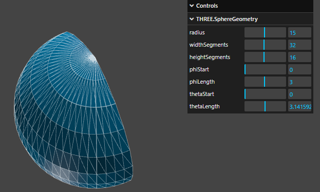

# 几何体
除了较低层的 BufferGeometry 外，three.js 还提供了多种实现类

# BoxGeometry
立方缓冲几何体，通常用来创建立方体或者不规则四边形
```js
// width, height, depth 分别是 x, y, z 轴上的 宽度，高度，深度， 默认值是 1
// segments 分别是分段数， 默认值是 1
BoxGeometry(width, height, depth, widthSegments?, heightSegemnts?, depthSegemnts?)

const geometry = new THREE.BoxGeometry( 1, 1, 1 ); 
const material = new THREE.MeshBasicMaterial( {color: 0x00ff00} ); 
const cube = new THREE.Mesh( geometry, material ); 
scene.add( cube );
```

# CircleGeometry
是欧式几何的一个简单形状，它由围绕着一个中心点的三角分段的数量所构造，由给定的半径来延展。同时它也可以用于创建规则多边形，其分段数量取决于该规则多边形的边数
```js
// radius 圆形的半径，默认值为 1
// segments, 分段的数量，最小值为 3， 默认值为 32
// thetaStart, 第一个分段的起始角度，默认为 0
// thetaLength, 圆形扇区的中心角，默认值是 2 * PI, 使其成为一个完整的园
CircleGeometry(radius, segments, thetaStart, thetaLength)

const geometry = new THREE.CircleGeometry( 5, 32 );
const material = new THREE.MeshBasicMaterial( { color: 0xffff00 } );
const circle = new THREE.Mesh( geometry, material );
scene.add( circle );
```

# EdgesGeometry
这可以作为辅助对象来查看 geometry 的边缘
```js
// geometry 是任意一个 几何体对象
// thresholdAngle 仅当相邻面的法线之间的角度(单位为 °)超过这个值时，才会渲染边缘，默认值为 1
EdgesGeometry(geometry: BufferGeometry, thresholdAngle: int)

const geometry = new THREE.BoxGeometry( 100, 100, 100 );
const edges = new THREE.EdgesGeometry( geometry );
const line = new THREE.LineSegments( edges, new THREE.LineBasicMaterial( { color: 0xffffff } ) );
scene.add( line );
```

# PlaneGeometry
一个生成平面几何体的类
```js
PlaneGeometry(width, height, widthSegments, heightSegments)

const geometry = new THREE.PlaneGeometry( 1, 1 );
const material = new THREE.MeshBasicMaterial( {color: 0xffff00, side: THREE.DoubleSide} );
const plane = new THREE.Mesh( geometry, material );
scene.add( plane );
```


# ShapeGeometry
通过 一个或多个 Shape 快速构建一个多边形几何体
```js
// shapes 是一个 Shape 或者 Shape 的数组
// curveSegments 是每一个形状的分段
ShapeGeometry(shapes: Arrray<Shape>, curveSegments: int)
```

# SphereGeometry
一个用于生成球形的类
```js
// radius 球体半径， 默认值 1
// widthSegments 水平分段， 默认值 32
// heightSegments, 垂直分段，默认值 16
// phiStart, 经线 起始角度，默认为 0
// phiLength, 经线扫描角度大小，默认值 2 * PI
// thetaStart, 纬线起始角度，默认值 0
// thetaLength, 纬线扫描角度大小，默认值 2* PI
SphereGeometry(radius, widthSegments, heightSegemnts, phiStart, phiLength, thetaStart, thetaLength)

const geometry = new THREE.SphereGeometry( 15, 32, 16 );
		const material = new THREE.MeshBasicMaterial( { color: 0xffff00 } );
		const sphere = new THREE.Mesh( geometry, material );
		scene.add( sphere );
```

