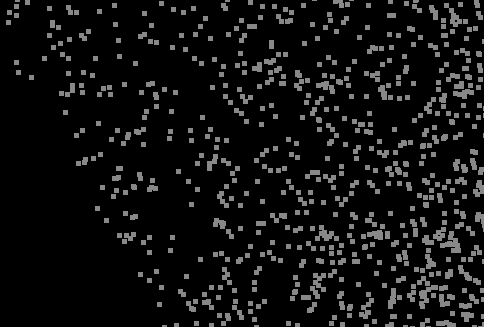
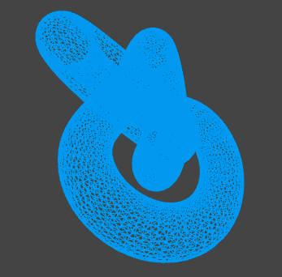
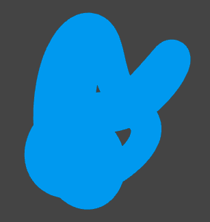

# 材质
材质负责几何体的颜色，纹理等信息。Three.js 内置了多种材质，每种材质其实就对应了底层的着色器

## 属性
* alphaTest, 这个值会用于 alpha test, 如果 alpha 低于这个值，则不会渲染
* needUpdates, 如果为 true, 则表示 material 需要重新 compile
* precision, 覆盖 renderer 关于当前材质精度的设置，可以是 highp, mediump, lowp
* side, 决定 哪一面会被渲染，可以是 THREE.FrontSide, THREE.BackSide, THREE.DoubleSide
* transparent,  决定当前 material 是否是透明的
* vertexColors, 决定是否使用 color 属性来渲染 顶点颜色，默认是 false
* visible

# LineBasicMaterial
继承自 Material, 用于绘制线框样式几何体的材质, 通常用于 Line object 的默认材质
```js
LineBasicMaterial(parameters?: Object)

const material = new THREE.LineBasicMaterial( {
	color: 0xffffff,
	linewidth: 1,
	linecap: 'round', //ignored by WebGLRenderer
	linejoin:  'round' //ignored by WebGLRenderer
} );
```
## 属性
* color, 当前材质的颜色
* linewidth, 线宽
* linecap, 线两端的样式，可以是 butt, round, square, 默认值为 round
* linejoin, 线段连接节点的样式，可以是 round, bevel, miter, 默认值为 round

# LineDashedMaterial
和 LineBasicMaterial 类似
## 属性
* dashSize, 虚线大小，是指破折号和间隙之和，默认值为 3
* gapSize, 间隙的大小，默认为 1
* scale, 线段中虚线部分的占比，默认值为 1
# PointsMaterial
通常用于 Points object 绘制的材质，但其底层并不是 circle, 而是 square
```js
PointsMaterial(parameter?: Object)
```
## 属性
* color, 材质的颜色
* size, 设置点的大小，默认值为 1.0
* sizeAttenuation, 指定点的大小是否因相机深度而衰减，默认为 true
* map, 材质的 Texture. 点的颜色会使用纹理的数据，还可以允许有 alpha channel, 这个通常会和 transparent 和 alphaTest 一起使用
* size, 点的大小，像素单位


# MeshBasicMaterial
一个简单着色(平面或者线框)方式来绘制几何体的材质，这种材质不受光照影响
## 属性
* color, 材质的颜色
* wireframe, 将几何体渲染为 线框，即多个三角带组成，默认为 false, 即渲染为平面多边形，将三角带渲染为平面
* wireframeLinecap
* wireframeLinejoin
* wireframeLinewidth



平面多边形 和 线段的区别

# MeshDepthMaterial
一种按照深度绘制几何体的材质，深度基于相机远近平面。白色最近，黑色最远
# ShaderMaterial
使用自定义 shader 渲染的材质。 shader 是一个用 GLSL 编写的小程序。  
使用 ShaderMaterial 需要注意以下事项：
* ShaderMaterial 只有使用 WebGLRender 才能正常 work
* 内置 attributes 和 uniforms 与代码一起传递到 shader
* 可以使用指令 *#pragma unroll_loop_start*， *#pragma unroll_loop_end* 以便通过 shader 预处理器在 GLSL 中展开 for 循环。该指令必须放在循环的正上方，循环格式必须与定义标准对应
```js
// 循环变量必须 是 i
// The value UNROLLED_LOOP_INDEX will be replaced with the explicity value of i for the given iteration and can be used in preprocessor statements 
#pragma unroll_loop_start
for ( int i = 0; i < 10; i ++ ) {

	// ...

}
#pragma unroll_loop_end
```

代码示例
```js
const material = new THREE.ShaderMaterial( {

	uniforms: {

		time: { value: 1.0 },
		resolution: { value: new THREE.Vector2() }

	},

	vertexShader: document.getElementById( 'vertexShader' ).textContent,

	fragmentShader: document.getElementById( 'fragmentShader' ).textContent

} );
```
# RawShaderMaterial
与 ShaderMaterial 类似，区别在于不会自动把内置 attributes 和 uniform 传递到 着色器