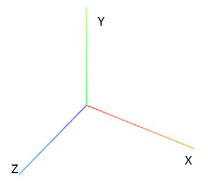
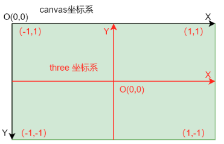

# 数学几何基础

# 坐标系
Three.js 使用右手坐标系，z 轴垂直屏幕，指向外面

可以使用 Three.AxesHelper 快速添加一个坐标系
```js
const axesHelper = new THREE.AxesHelper(100);
scene.add(axesHelper);
```
## 世界坐标系
可以理解为所有 object 所在的场景的坐标系, 比如原始的数据，直接放在世界坐标系里
## 视点坐标系
相机所在的坐标系，视线方向为 z 轴的正方向。世界坐标系的物体需要先变换到视点坐标系，在可视范围之外的点会被裁剪
## 屏幕坐标系
世界坐标系最后会显示在设备所对应的位置，比如 canvas 上。

综合来看，物体的坐标转换过程大致上为：
```js
//局部坐标系 => 世界坐标系 => 视点坐标系 => 裁剪空间坐标系 => 屏幕坐标系
// 局部坐标系到世界坐标系的转换就在于要把所有物体放到同一场景下，使用相同的世界坐标系
// 再考虑到相机的作用，需要 apply 相机的转换矩阵
// 转换到视点坐标系后，需要映射到裁剪空间，裁剪空间是标准的 正方体，原点在 (0,0,0), 边长为 2
vec3.project(camera) {
    // 矢量 vec 本身在世界坐标系里，通过相机的 matrixWorldInverse 转换到视点坐标系中
    // 再根据 camera.projectMatrix 映射到裁剪空间里
    return this.applyMatrix4(camera.matrixWorldInverse).applyMatrix4(camera.projectMatrix)
}
// 最后把裁剪空间再映射到屏幕坐标系中
```

最后裁剪空间到屏幕坐标之间的转换
## 世界坐标转屏幕坐标
世界坐标 => 裁剪空间坐标 => 屏幕坐标
```js
const vec3: Vec3
// 将世界坐标转换为 裁剪空间坐标，其范围为 [-1, 1]
const coor = vec3.project(camera)
// 假设画布宽度为 w, 高度为 h, 屏幕坐标点是 (x,y). 裁剪空间坐标点为 (x1, y1)
// 根据 等比
(x1 + 1) / 2 = x / w => x1 = 2 * x / w - 1, x = (x1 + 1) * w / 2
(1 - y1) / 2 = y / h => y1 = -(y / h) * 2 + 1, y = (1 - y1) * h / 2

// 所以在根据 vec3 获取 裁剪坐标 coor 后，就可以根据 公式获取屏幕坐标
```

## 坐标系总结
每一份数据，都在自己的局部坐标系里。比如有两个人，都在自己的原点上，有不同的身高等信息。  
为了把不同的人放在相同的世界坐标系里，就需要对不同的人进行局部坐标系到世界坐标系的转换，比如 一个人放在左下角，一个人放在右上角，来避免大家重叠站位。这个就是局部坐标系到世界坐标系的转换。  
大多数场景下，所有物体本身就在同一坐标系下，就不需要这个转换了。  
那在世界坐标系下后，还需要考虑摄像机的位置和角度。摄像机可能在世界空间里的任意位置，那么基于这个摄像机对世界坐标的观察，就是把世界坐标转换到视点坐标系中。  
最后为了达到投影的效果，把摄像机观察到的东西，投影到裁剪空间，就需要摄像机的 投影变换。经过这个变换后，物体就进入到了裁剪空间，其坐标称之为标准设备坐标系。标准设备坐标系就是在 (-1,-1,-1) 到 (1,1,1) 的立方体空间。  
最后，裁剪空间，即标准设备坐标系还需要转换到屏幕，即 canvas 坐标系里。canvas 是左上角 (0, 0), 那么就还需要进行一次转换。
```js
// 世界坐标系 => 标准设备坐标系 => 屏幕坐标系
const vec3: Vector3 // 世界坐标
const view = modelViewMatrix * vec3 // 视点坐标
const projection = projectionMatrix * view // 裁剪坐标
```