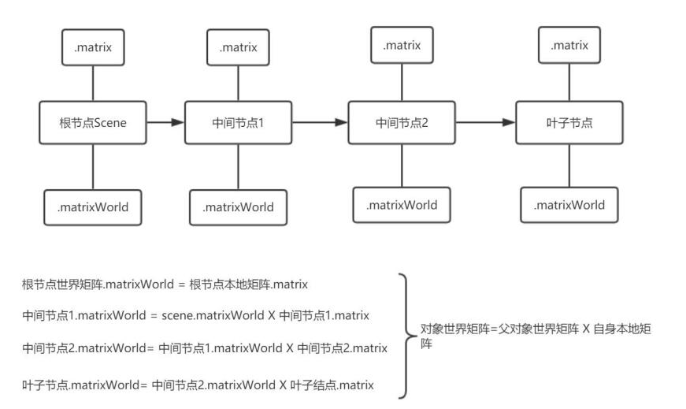

# Three
Three 是在 webgl 基础上进行封装的 library, 它有几个基础概念
* scene, 场景，用来添加需要渲染的物体
* geomerty，场景中的 几何体，通常认为是一系列顶点信息(属性)的集合体，在废置时需要自己是否 geometry.dispose()
* material, 物体上的 color 或者 纹理 信息，通过该信息构建一个着色器程序。three 尽可能尝试复用已经存在的着色器，且着色器会在所有相关材质被废置后才会释放, material.dispose()
* object, three.js 里的物体，类似于 Mesh, 集成了 几何体和材质
* lighting, 对光源进行仿真

一个基础的渲染渲染立方体的例子
```js
export function Cube() {
  const refContainer = useRef<HTMLDivElement>(null);
  useEffect(() => {
    // === THREE.JS CODE START ===
    var scene = new THREE.Scene();
    // 透视矩阵
    var camera = new THREE.PerspectiveCamera(75, window.innerWidth / window.innerHeight, 0.1, 1000);
    var renderer = new THREE.WebGLRenderer();
    // 指定渲染的场景大小，可和 canvas 大小不一样
    renderer.setSize(window.innerWidth, window.innerHeight);
    // document.body.appendChild( renderer.domElement );
    // use ref as a mount point of the Three.js scene instead of the document.body
    refContainer.current && refContainer.current.appendChild( renderer.domElement );
    // 添加一个 立方体
    var geometry = new THREE.BoxGeometry(1, 1, 1);
    var material = new THREE.MeshBasicMaterial({ color: 0x00ff00 });
    var cube = new THREE.Mesh(geometry, material);
    // 如果设置 matrixAutoUpdate 为 false, 那么当参数变换时，并不会自动更新 转换矩阵，从而物体可能会保持静止
    cube.matrixAutoUpdate = false;
    scene.add(cube);

    // line 的材质就只有 line basic 和 line dashed
    const lineMaterial = new THREE.LineBasicMaterial({ color: 0x0000ff });
    const points = [];
    points.push(new THREE.Vector3(0, 0, 3));
    points.push(new THREE.Vector3(0, 3, -3));
    points.push(new THREE.Vector3(0, 0, -3));
    
    // buffer geometries 将信息存储在 buffer 里，这使得它们比标准 geometry 更快，但是更难用
    const lineGeometry = new THREE.BufferGeometry().setFromPoints(points);
    const line = new THREE.Line(lineGeometry, lineMaterial);
    scene.add(line);
    camera.position.set(-10, 0, 0);
    camera.lookAt(0, 0, 0);

    var animate = function () {
      requestAnimationFrame(animate);
      // 添加 旋转
      cube.rotation.x += 0.01;
      cube.rotation.y += 0.01;
      // 因为自动更新被禁止，所以在这里手动更新
      cube.updateMatrix();
      line.rotation.x += 0.01;
      // 真正的触发渲染
      renderer.render(scene, camera);
    };
    animate();
  }, []);
  return (
    <div ref={refContainer}></div>
  );
}
```

# 更新场景
一般来说，three.js 的 object 会在参数更改时自动更新。可以通过 *object.matrixAutoUpdate = false* 来禁止这一行为，然后通过 *object.updateMatrix()* 来手动更新矩阵。  
# 废置对象
很多对象都绑定了一些底层的 buffer, three.js 并不会自动回收，因为很多 object 可能当前帧不用，但是下一帧会使用，也可能一些 buffer 会被多个 object 共享。所以对象的废置都需要手动调用 *object.dispose()*

# 矩阵变换
Three.js 使用 matrix 来编码3D 变换，包括 平移，缩放，旋转。Object3D 的每个实例都有一个 matrix, 用于存储该对象应该 applied 的矩阵变换。  
有两种方法可以修改对象的矩阵
## 修改属性
修改对象的 position, quaterninon/rotation,  和 scale 属性， 让 three.js 来重新计算对象的变换矩阵
```js
// 默认情况下，matrixAutoUpdate 为 true, 那么 对象的 matrix 则会自动更新
object.position.set(0, 0, 1)
object.position.z = 5
// 如果对象是静态的，或者希望手动控制，来达到更好的性能，需要设置为 false
object.matrixAutoUpdate = false
// 在更新属性后，需要手动更新矩阵
object.updateMatrix()
```
## 修改矩阵
 直接修改矩阵对象，注意这个时候 matrixAutoUpdate 需要为 false, 并且自己不能手动调用 updateMatrix(), 否则将根据当前 position, scale 重新计算 matrix
 ```js
object.matrix.setRotationFromQuaternion( quaternion );
object.matrix.setPosition( start_position );
 ```
 一个对象的 matrix 存储了该对象，相对于其 Object3D.parent 父节点的变换。要在世界坐标系中获取对象的转换，必须访问该对象的 Object3D.matrixWorld.  
 当父对象或者子对象的变换发生更改时，可以调用 Object3D.updateMatrixWorld() 来请求更新子对象的 matrixWorld  
 
 ## 旋转和四元数
 Three.js 提供了两种表示 3D 旋转的方式，欧拉角和四元数，以及两者之间的转换。