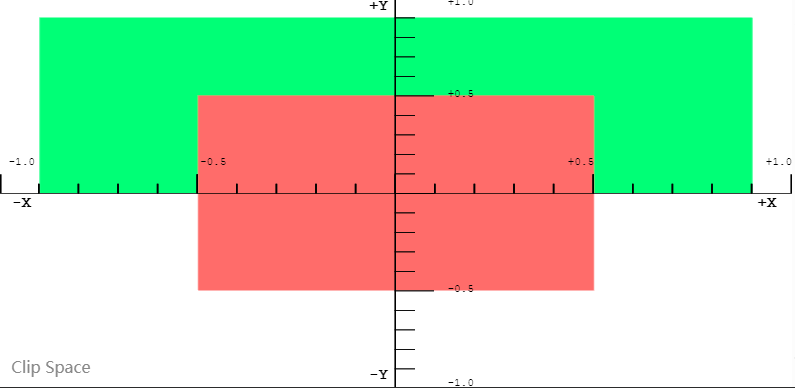
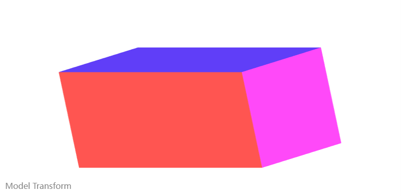
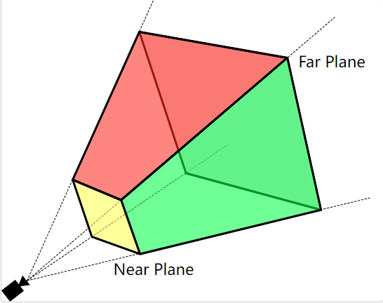

# 模型，视图，投影矩阵
webgl 空间中的点，是通过将原始数据通过矩阵变换，投影到一个称为 *裁剪空间* 的特殊坐标空间中。该裁剪空间，是中心点坐标为 (0,0,0), 角落范围在 (-1,-1,-1) 到 (1,1,1) 的立方体。  
该裁剪空间被压缩到一个二维空间并栅格化为图像。  

## 模型矩阵
模型矩阵定义了如何获取原始数据模型，以及在 3D 世界空间里移动
## 投影矩阵
投影矩阵用于将 世界空间坐标转化为裁剪空间左边。常用的投影矩阵，如 透视矩阵，用于模拟充当虚拟世界中相机的效果.  
映射到裁剪空间之外的任何数据都会被裁剪，且不会被渲染
## 视图矩阵
视图矩阵负责移动场景中的对象以模拟相机位置的变化，改变观察者当前能够看到的内容

```js
// 获取 webgl context
const canvas = document.getElementById('canvas')
const gl = canvas.getContext('webgl');

// 初始化 vertex shader 和 fragment shader
// 顶点着色器用于放置顶点，片段着色器为每个像素着色
const vertex = `
  // The individual position vertex
  // 一个顶点位置， position 的名字需要和代码里 gl.getAttributeLocation(program, 'position') 相同
  attribute vec3 position;

  void main() {
    // the gl_Position is the final position in clip space after the vertex shader modifies it
    // gl_Position 是顶点着色器对其修改后在裁剪空间的最终位置
    gl_Position = vec4(position, 1.0); // 第四个数值一般称之为 w， 用作分量放除数， 因此 x,y,z 的真实值被计算为 x/w, y/w, z/w, 称之为齐次坐标
    // 笛卡尔转齐次坐标，(x,y,z) => (x,y,z,1), 齐次坐标转笛卡尔 (p1, p2, p3, p4) => (p1/p4,p2/p4,p3/p4)
    // 使用四维齐次坐标的好处在于， 方便与四维矩阵相乘，且齐次坐标和笛卡尔坐标(三维坐标) 之间的转换也很简单
  }
`
// 接下来，需要将实际数据栅格化为像素，片段着色器在每个像素的基础上计算评估一切，设置一个单一颜色。
// GPU 为需要渲染的每个像素调用着色器方法，着色器的工作是返回用于该像素的颜色
const fragment = `
  precision mediump float;
  // 使用 uniform 的颜色 color， 名字需要和 gl.getUniformLocation(program, 'color') 一致
  uniform vec4 color;
  
  void main() {
    // gl_FragColor 就是最终像素的颜色
    gl_FragColor = color;
  }
`

function createShader(gl, source, type) {
    const shader = gl.createShader(type)// type here could be gl.VERTEX_SHADER, gl.FRAGMENT_SHADER
    gl.shaderSource(shader, source)
    gl.compileShader(shader)

    if (!gl.getShaderParameter(shader, gl.COMPILE_STATUS)) {
        throw `Fail to create shader: ${gl.getShaderInfoLog(shader)}`
    }
    return shader
}

const vertexShader = createShader(gl, vertex, gl.VERTEX_SHADER)
const fragmentShader = createShader(gl, fragment, gl.FRAGMENT_SHADER)

// link program
const program = gl.createProgram()
gl.attachShader(program, vertexShader)
gl.attachShader(program, fragmentShader)

gl.linkProgram(program)

// use program
gl.useProgram(program)

// save attribute and uniform location
// 类似于获取指向存储 location 的引用，之后可以使用该引用去更新值
// gl 里顶点位置和颜色都存储在 gl 缓冲区，作为属性发到着色器
const positionLocation = gl.getAttributeLocation(program, 'position')
const colorLocation = gl.getUniformLocation(program, 'color')

// enable depth test, if element is behind, it will not be drawn
gl.enable(gl.DEPTH_TEST)


function draw(settings) {
  const data = new Float32Array([
   
    //Triangle 1
    settings.left,  settings.bottom, settings.depth,
    settings.right, settings.bottom, settings.depth,
    settings.left,  settings.top,    settings.depth,
    
    //Triangle 2
    settings.left,  settings.top,    settings.depth,
    settings.right, settings.bottom, settings.depth,
    settings.right, settings.top,    settings.depth
  ]);

  // Use WebGL to draw this onto the screen.
  
  // Performance Note: Creating a new array buffer for every draw call is slow.
  // This function is for illustration purposes only.

  
  // Create a buffer and bind the data
  const buffer = gl.createBuffer();
  gl.bindBuffer(gl.ARRAY_BUFFER, buffer);
  gl.bufferData(gl.ARRAY_BUFFER, data, gl.STATIC_DRAW);
  
  // Setup the pointer to our attribute data (the triangles)
  // 使用该 position 引用
  gl.enableVertexAttribArray(this.positionLocation);
  // 指定该怎么去解析 data array
  // 3 numComponents, 表示每次迭代从 buffer pull 3 个 value
  // type, gl.FLOAT 表示每个 value 的 type
  // normalize flag, false 表示不做 normalize
  // stride, 0 表示使用 numComponents 和 type 来计算需要 pull 的 bytes 大小
  // offset, how many bytes inside the buffer to start from
  gl.vertexAttribPointer(this.positionLocation, 3, gl.FLOAT, false, 0, 0);
  
  // Setup the color uniform that will be shared across all triangles
  // 通过 color 的引用更新 color
  gl.uniform4fv(this.colorLocation, settings.color);

  // Draw the triangles to the screen
  gl.drawArrays(gl.TRIANGLES, 0, 6);
}

draw({
  top: 0.5, // x
  bottom: -0.5, // x
  left: -0.5, // y
  right: 0.5, // y

  depth: 0, // z
  color: [1, 0.4, 0.4, 1], // red
});

draw({
  top: 0.9, // x
  bottom: 0, // x
  left: -0.9, // y
  right: 0.9, // y

  depth: 0.5, // z
  color: [0.4, 1, 0.4, 1], // green
});

draw({
  top: 1, // x
  bottom: -1, // x
  left: -1, // y
  right: 1, // y

  depth: -1.5, // z
  color: [0.4, 0.4, 1, 1], // blue
});
```


# 模型转换
将点直接放入裁剪空间的用途有限，实际应用中，数据坐标不会在裁剪空间中，因此需要将数据模型坐标转换到裁剪空间中。  
数据源 -> 模型矩阵 -> 裁剪空间。 模型矩阵表达数据源需要进行的一系列矩阵转换。  
refer to https://jsfiddle.net/tatumcreative/5jofzgsh/
```js
const cube = {
    positions: [], // 顶点坐标， 每三个元素组成一个坐标，每四个坐标组成一个面， 共 24 个顶点
    colors: [], // 顶点颜色， 每四个元素，组成一个顶点颜色， 共 24 个颜色
    elements: [],
}

// create buffer for cube 
const positionsBuffer = gl.createBuffer()
gl.bindBuffer(gl.ARRAY_BUFFER, positionsBuffer)
gl.bufferData(gl.ARRAY_BUFFER, new Float32Array(cube.positions), gl.STATIC_DRAW)

const colorsBuffer = gl.createBuffer()
gl.bindBuffer(gl.ARRAY_BUFFER, colorsBuffer)
gl.bufferData(gl.ARRAY_BUFFER, new Float32Array(cube.colors), gl.STATIC_DRAW)

const elementsBuffer = gl.createBuffer();
gl.bindBuffer(gl.ELEMENT_ARRAY_BUFFER, elementsBuffer);
gl.bufferData(gl.ELEMENT_ARRAY_BUFFER, new Uint16Array(cube.elements), gl.STATIC_DRAW);

// 初始化 vertex, fragment shader
const vertex = `
  // Each point has a position and color
  attribute vec3 position;
  attribute vec4 color;
  
  // The transformation matrix
  uniform mat4 model;

  // Pass the color attribute down to the fragment shader
  varying vec4 vColor;

  void main() {
    
    //Pass the color down to the fragment shader
    vColor = color;
    
    // Multiply the 
    gl_Position = model * vec4(position, 1.0);
  }
`

const fragment = `
  precision mediump float;
  varying vec4 vColor;
  
  void main() {
    gl_FragColor = vColor;
    // gl_FragColor = vec4(1.0, 0.0, 0.0, 1.0);
  }
`
// 和上一个案例类似，创建 shader, 以及 program
// 保存 locations
const locations = {}
locations.model = gl.getUniformLocation(webglProgram, "model");
locations.position = gl.getAttribLocation(webglProgram, "position");
locations.color = gl.getAttribLocation(webglProgram, "color");

const getModelMatrix = () => {
    // return a serial of matrix
}

const updateAttributesAndUniforms = (matrixs) => {
    gl.uniformMatrix4fv(locations.model, false, matrixs)

    gl.enableVertexArrtibArray(locations.position)
    gl.bindBuffer(gl.ARRAY_BUFFER, positionsBuffer)
    gl.vertexAttributePointer(locations.position, 3, gl.FLOAT, false, 0, 0)

    gl.enableVertexArrtibArray(locations.color)
    gl.bindBuffer(gl.ARRAY_BUFFER, colorsBuffer)
    gl.vertexAttributePointer(locations.color, 4, gl.FLOAT, false, 0, 0)

    gl.bindBuffer(gl.ELEMENT_ARRAY_BUFFER, elementsBuffer);
}

const draw = () => {
    const matrixs = getModelMatrix()
    updateAttributesAndUniforms(matrixs)

    // perform actual draw
    gl.drawElements(gl.TRIANGLES, 36, gl.UNSIGNED_SHORT, 0)

    requestAnimationFrame(draw)
}
```


## Experience
uniform location 用来存储一些所有顶点共享的数据， attribute 用于存储一些每个顶点不一样的数据。  
在这个示例中，我们会给正方体每个顶点有相同的 模型矩阵，所以使用 uniformLocation, 每个面有自己的顶点位置和 颜色，所以使用 attributeLocation.  
获取到的 location 其实本质上只是一个具名指针，后续需要把 buffer data 绑定到该 location 上  
```js
// 生成 location
const modelLocation = gl.getUniformLocation(webglProgram, "model");
const positionLocation = gl.getAttribLocation(webglProgram, "position");

// 创建 buffer
const positionsBuffer = gl.createBuffer()
// gl 绑定 buffer, 表示当前后续操作使用该 buffer？
gl.bindBuffer(gl.ARRAY_BUFFER, positionsBuffer)
// 给 buffer 填充数据
gl.bufferData(gl.ARRAY_BUFFER, new Float32Array(cube.positions), gl.STATIC_DRAW)
```
在画图时，首先得到一些随机的模型矩阵，用于映射数据到裁剪空间。然后，就需要把准备好的 buffer 绑定到对应的 location 上
```js
// 更新 uniform location model, 该 model 实际上是 4*4 数组
// 在着色器里，就可以通过 uniform mat4 model; 使用该 model matrix
gl.uniformMatrix4fv(modelLocation, false, new Float32Array(this.transforms.model));

// 允许顶点着色器通过属性访问 position attribute location
gl.enableVertexAttribArray(positionLocation)
gl.bindBuffer(gl.ARRAY_BUFFER, positionsBuffer)
// 让 positionLocation 指向当前绑定的 buffer?, 从而能在着色器里访问数据
gl.vertexAttributePointer(positionLocation, 3, gl.FLOAT, false, 0, 0)
```
# 除以 w
由上述例子可知，在着色器里，顶点的坐标其实是用的 齐次坐标 (x,y,z,w), 一般在笛卡尔坐标转换为齐次坐标时，w = 1, 最后真正应用的坐标其实是 (x/w,y/w,z/w, 1).  
为了获得透视效果，我们可以把 w 简单设为 z 值， 即 (x,y,z,z). 但为了避免 z = 0 的情况，将其修改为 (1.0 + z) * scaleFactor. 因为 z 是 -1 ~ 1 之间的数， 这就保证了 w 不会为 0.  
```js
const vertex = `
  // Each point has a position and color
  attribute vec3 position;
  attribute vec4 color;
  
  // The projection matrix
  uniform mat4 model;

  // Pass the color attribute down to the fragment shader
  // fragment 着色器不能访问 attribute?
  varying vec4 vColor;

  void main() {
    
    // Pass the color down to the fragment shader
    vColor = color;
    
    // First transform the point      
    vec4 transformedPosition = model * vec4( position, 1.0 );
    
    // How much affect does the perspective have?
    float scaleFactor = 0.5;
    
    // Set w by taking the Z value which is typically ranged -1 to 1, then scale
    // it to be from 0 to some number, in this case 0-1.
    float w = (1.0 + transformedPosition.z) * scaleFactor;
    
    // Save the new gl_Position with the custom w component
    gl_Position = vec4( transformedPosition.xyz, w );
  }
`
```
# 简单投影
上述案例，是手动在着色器里设置 w 值，其实可以直接使用矩阵变换
```js
// 注册一个 project matrix location
const projectionLocation = gl.getUniformLocation(webglProgram, "projection");

const projection = [
    	1, 0, 0, 0,
		0, 1, 0, 0,
		0, 0, 1, scaleFactor, // Note the extra scale factor here
		0, 0, 0, scaleFactor
]
// 将 project location 数据 更新为 projection 
gl.uniformMatrix4fv(projectionLocation, false, new Float32Array(projection));

// 在顶点着色器就可以直接使用该变量
const vertex = `
  //Each point has a position and color
  attribute vec3 position;
  attribute vec4 color;

  // The transformation matrices
  uniform mat4 model;
  uniform mat4 projection;

  // Pass the color attribute down to the fragment shader
  varying vec4 vColor;

  void main() {
    
    // Pass the color down to the fragment shader
    vColor = color;
    
    // Read the multiplication in reverse order, the original point is moved
    // into clip space, and then projected into a perspective view by filling
    // in the W component
    gl_Position = projection * model * vec4( position, 1.0 );
  }
`
```
# 透视矩阵
简单投影无法处理场景数据的大范围值，大多数场景在裁剪空间中不起作用。这个时候就需要使用 *透视矩阵*。  
## view frustum
  
为了减少需要渲染的 polygon, 采用 view frustum.只渲染在 near plane 和 far plane 之间，且在 view angle 之内的 polygons.  
任何在 金字塔外的 polygon 都不会被渲染，处于交界处的 polygon 会裁剪掉位于 金字塔外的部分。  
在这个基础上，仍然可以继续减少需要渲染的 polygon
 * back-face culling, 删掉 那些背面朝向 camera 的 polygon
 * hidden-surface determination, 删掉那些被更靠近 camera 的 polygon 完全遮挡 的 polygons  

需要注意的是，透视矩阵会翻转 z 轴。在裁剪空间中，z 轴是远离 观察者的。在应用 透视矩阵后，z 轴会 come towards 观察者。  
翻转 z 轴的原因在于，裁剪空间的坐标系是左手坐标系，z 轴指入屏幕，且远离观察者。而数学，物理，3D 建模中，我们使用 右手坐标系，z 轴指出屏幕，朝向观察者。
```js
const perspectiveMatrix = function (
  fieldOfViewInRadians, // 一个弧度表示的角度，指示观察者可以看多宽的场景。数字越大，摄像机可见的越大，边缘形状越来越失真。视野越大，通常物体会变小。当视野较小时，摄像机看到的东西越少，物体因透视而变形的程度要小的多，并且物体似乎更靠近相机
  aspectRatio, // 场景的宽高比，等于其宽度除以高度，用以解决当窗口大小改变时，物体形状变形的问题
  near, // 一个正数，表示相机到 near plane 的垂直距离。在裁剪空间中，对应着 -1
  far, // 一个整数，表示相机到 far plane 的垂直距离，在裁剪空间中，对应着 1
) {
  var f = 1.0 / Math.tan(fieldOfViewInRadians / 2);
  var rangeInv = 1 / (near - far);

  return [
    f / aspectRatio,
    0,
    0,
    0,
    0,
    f,
    0,
    0,
    0,
    0,
    (near + far) * rangeInv,
    -1,
    0,
    0,
    near * far * rangeInv * 2,
    0,
  ];
};

```
# 视图矩阵
我们可能需要旋转，平移，缩放场景中的物体，一种方式是通过操作相机，物体保持不动来完成，一种是直接操作物体，相机保持不动。相机和物体的运动是相逆的。  
webgl 中通过移动物体来实现
```js
// 首先经过 模型矩阵 model 将数据映射到 裁剪空间
// view 视图矩阵模拟相机的变换，实现平移，渲染，缩放的操作
// projection 透视矩阵实现透视效果
gl_Position = projection * view * model * vec4(position, 1.0);
```